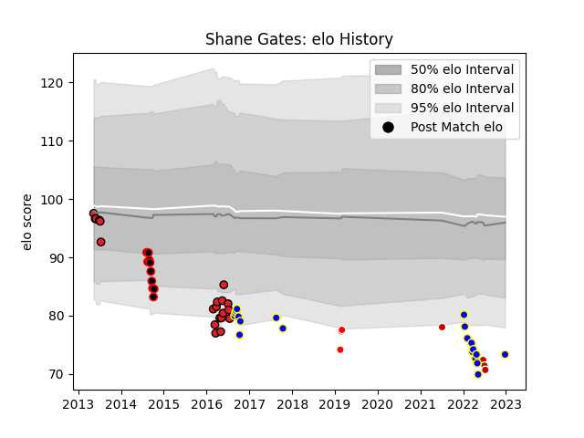

---  
layout: page  
title: Shane Gates  
date: 2022-12-28 12:53:59.054733  
categories: player  
---
# Shane Gates

## Positions: C

## Country: Japan

## Current elo: 73.0

## Current Percentile: 1.0

# Elo History

# Match History

| Team                   |   Appearances |   Win Rate |
|:-----------------------|--------------:|-----------:|
| Southern Kings         |            20 |   0.15     |
| Urayasu D-Rocks        |            20 |   0.45     |
| Eastern Province Kings |            10 |   0.1      |
| Japan                  |             4 |   0.25     |
| Sunwolves              |             3 |   0.333333 |

| Opponent                          |   Matches |   Win Rate |
|:----------------------------------|----------:|-----------:|
| Sharks                            |         4 |   0        |
| Black Rams Tokyo                  |         3 |   0.666667 |
| Stormers                          |         3 |   0        |
| Kobelco Kobe Steelers             |         3 |   0.333333 |
| Highlanders                       |         2 |   0.5      |
| Western Province                  |         2 |   0        |
| Shizuoka Blue Revs                |         2 |   0        |
| Saitama Wild Knights              |         2 |   0        |
| Lions                             |         2 |   0        |
| Kubota Spears Funabashi Tokyo-Bay |         2 |   0        |
| Blue Bulls                        |         2 |   0        |
| Jaguares                          |         2 |   0.5      |
| Chiefs                            |         2 |   0.5      |
| Green Rockets Tokatsu             |         2 |   1        |
| Golden Lions                      |         2 |   0        |
| France                            |         2 |   0        |
| Cheetahs                          |         2 |   0        |
| Griquas                           |         1 |   0        |
| Blues                             |         1 |   0        |
| Uruguay                           |         1 |   1        |
| Toyota Verblitz                   |         1 |   1        |
| Tokyo Sungoliath                  |         1 |   0        |
| Sunwolves                         |         1 |   1        |
| Bulls                             |         1 |   0        |
| Shimizu Blue Sharks               |         1 |   1        |
| Pumas                             |         1 |   1        |
| Coca-Cola Red Sparks              |         1 |   1        |
| Hanazono Kintetsu Liners          |         1 |   1        |
| New South Wales Waratahs          |         1 |   0        |
| Natal Sharks                      |         1 |   0        |
| Crusaders                         |         1 |   0        |
| Free State Cheetahs               |         1 |   0        |
| Ireland                           |         1 |   0        |
| Hurricanes                        |         1 |   0        |
| Yokohama Canon Eagles             |         1 |   0        |