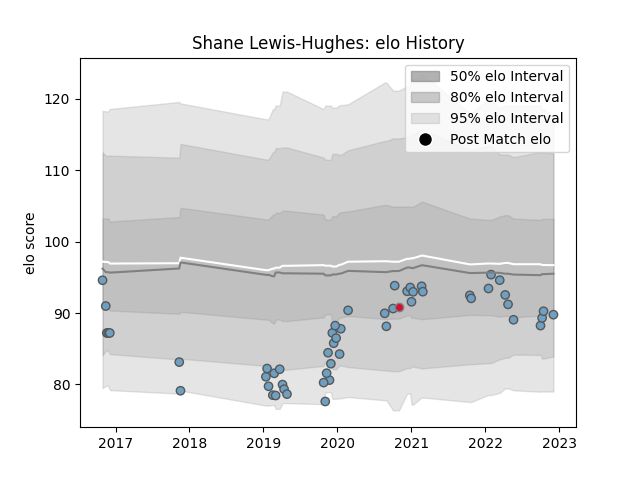

---  
layout: page  
title: Shane Lewis-Hughes  
date: 2023-02-02 19:07:36.449353  
categories: player  
---
# Shane Lewis-Hughes

## Positions: FL

## Country: Wales

## Current elo: 99.0

## Current Percentile: 3.0

# Elo History

# Match History

| Team          |   Appearances |   Win Rate |
|:--------------|--------------:|-----------:|
| Cardiff Blues |            56 |   0.446429 |
| Wales         |             1 |   0        |

| Opponent          |   Matches |   Win Rate |
|:------------------|----------:|-----------:|
| Ospreys           |         7 |   0.285714 |
| Scarlets          |         6 |   0.5      |
| Connacht          |         5 |   0.4      |
| Dragons           |         4 |   1        |
| Benetton Treviso  |         3 |   0.666667 |
| Munster           |         3 |   0        |
| Lions             |         2 |   0        |
| Ulster            |         2 |   0        |
| Southern Kings    |         2 |   1        |
| Pau               |         2 |   0.5      |
| Newcastle Falcons |         2 |   0.5      |
| Leinster          |         2 |   0.5      |
| Leicester Tigers  |         2 |   0        |
| Glasgow Warriors  |         2 |   0        |
| Edinburgh         |         2 |   0.5      |
| Calvisano         |         2 |   1        |
| Brive             |         1 |   0        |
| Lyon              |         1 |   1        |
| Harlequins        |         1 |   0        |
| Exeter Chiefs     |         1 |   0        |
| Cheetahs          |         1 |   1        |
| Scotland          |         1 |   0        |
| Sharks            |         1 |   1        |
| Bulls             |         1 |   0        |
| Zebre             |         1 |   1        |