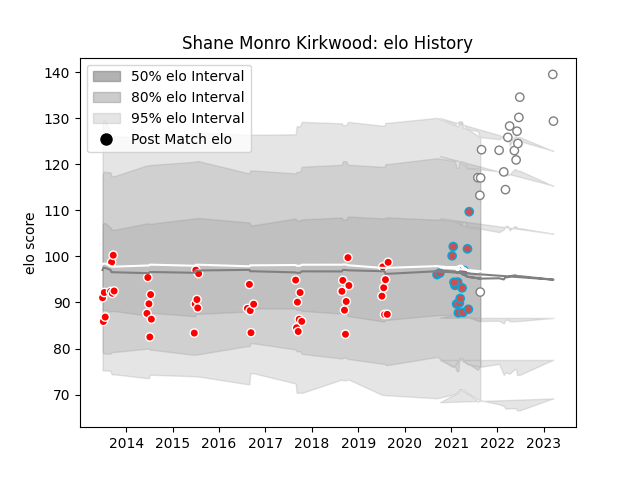

---  
layout: page  
title: Shane Monro Kirkwood  
date: 2023-03-17 17:19:05.250973  
categories: player  
---
# Shane Monro Kirkwood

## Positions: L

## Current elo: 92.0

## Current Percentile: 84.0

# Elo History

# Match History

| Team             |   Appearances |   Win Rate |
|:-----------------|--------------:|-----------:|
| Valke            |            47 |   0.414894 |
| Pumas            |            18 |   0.555556 |
| Bourgoin-Jallieu |            17 |   0.352941 |

| Opponent               |   Matches |   Win Rate |
|:-----------------------|----------:|-----------:|
| SWD Eagles             |         9 |   0.388889 |
| Leopards               |         8 |   0.25     |
| Boland Cavaliers       |         7 |   0.428571 |
| Border Bulldogs        |         7 |   0.714286 |
| Griffons               |         7 |   0.428571 |
| Griquas                |         5 |   0.3      |
| Free State Cheetahs    |         4 |   0.75     |
| Blue Bulls             |         4 |   0.25     |
| Eastern Province Kings |         4 |   0.5      |
| Golden Lions           |         3 |   1        |
| Western Province       |         3 |   0.5      |
| Dijon                  |         2 |   1        |
| Dax                    |         2 |   0        |
| Chambery               |         2 |   0.5      |
| Massy                  |         2 |   0.5      |
| Nice                   |         2 |   0        |
| Albi                   |         2 |   0.5      |
| Aubenas                |         1 |   0        |
| Jaguares XV            |         1 |   0        |
| Namibia Welwitchias    |         1 |   1        |
| Narbonne               |         1 |   0        |
| Natal Sharks           |         1 |   0        |
| Pumas                  |         1 |   0        |
| Blagnac                |         1 |   1        |
| Tarbes                 |         1 |   0        |
| US Bressane            |         1 |   0        |