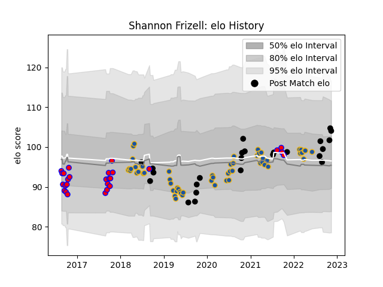

---  
layout: page  
title: Shannon Frizell  
date: 2023-03-17 17:35:19.488969  
categories: player  
---
# Shannon Frizell

## Positions: FL, L

## Country: New Zealand

## Current elo: 93.0

## Current Percentile: 74.0

# Elo History

# Match History

| Team        |   Appearances |   Win Rate |
|:------------|--------------:|-----------:|
| Highlanders |            59 |   0.389831 |
| Tasman      |            28 |   0.660714 |
| New Zealand |            26 |   0.788462 |

| Opponent                 |   Matches |   Win Rate |
|:-------------------------|----------:|-----------:|
| Blues                    |        11 |   0.272727 |
| Chiefs                   |        10 |   0.45     |
| Crusaders                |        10 |   0.2      |
| Hurricanes               |         8 |   0.25     |
| Argentina                |         5 |   0.6      |
| South Africa             |         5 |   0.7      |
| Australia                |         4 |   0.875    |
| Taranaki                 |         4 |   0.75     |
| Canterbury               |         4 |   0        |
| Waikato                  |         3 |   0.666667 |
| New South Wales Waratahs |         3 |   0.333333 |
| North Harbour            |         3 |   0.833333 |
| Auckland                 |         3 |   1        |
| Bulls                    |         3 |   0.5      |
| Melbourne Rebels         |         3 |   0.666667 |
| Northland                |         2 |   1        |
| Southland                |         2 |   1        |
| Otago                    |         2 |   0.5      |
| Hawke's Bay              |         2 |   0.5      |
| Stormers                 |         2 |   0.5      |
| France                   |         2 |   0.5      |
| Fiji                     |         2 |   1        |
| Wales                    |         2 |   1        |
| Brumbies                 |         2 |   1        |
| Sharks                   |         2 |   0        |
| Sunwolves                |         1 |   1        |
| Scotland                 |         1 |   1        |
| Wellington               |         1 |   1        |
| Manawatu                 |         1 |   0        |
| Queensland Reds          |         1 |   1        |
| Namibia                  |         1 |   1        |
| Moana Pasifika           |         1 |   1        |
| Lions                    |         1 |   0        |
| Japan                    |         1 |   1        |
| Italy                    |         1 |   1        |
| England                  |         1 |   0.5      |
| Counties Manukau         |         1 |   1        |
| Canada                   |         1 |   1        |
| Western Force            |         1 |   1        |