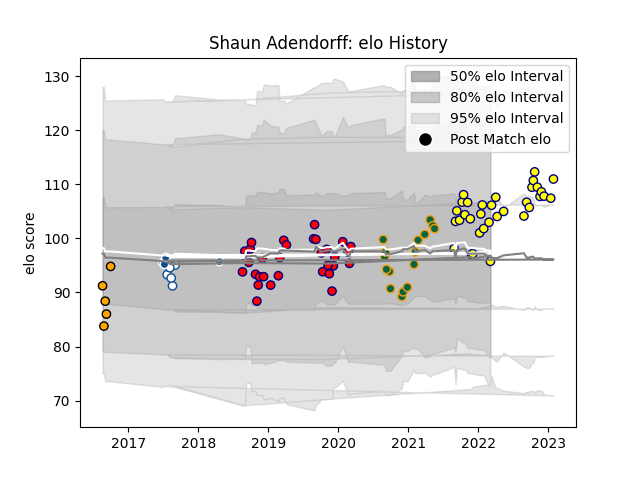

---  
layout: page  
title: Shaun Adendorff  
date: 2022-11-22 11:30:44.979367  
categories: player  
---
# Shaun Adendorff

## Positions: N8, FL

## Current elo: 96.0

## Current Percentile: 45.0

# Elo History

# Match History

| Team               |   Appearances |   Win Rate |
|:-------------------|--------------:|-----------:|
| Aurillac           |            30 |   0.566667 |
| Nevers             |            26 |   0.519231 |
| Northampton Saints |            16 |   0.4375   |
| Boland Cavaliers   |             5 |   0.2      |
| Bulls              |             4 |   0.5      |
| Blue Bulls         |             2 |   0.5      |

| Opponent            |   Matches |   Win Rate |
|:--------------------|----------:|-----------:|
| Vannes              |         6 |   0.333333 |
| Provence Rugby      |         6 |   0.666667 |
| Montauban           |         5 |   0.4      |
| Oyonnax             |         4 |   0.5      |
| Carcassonne         |         4 |   0.75     |
| Massy               |         3 |   1        |
| Rouen               |         3 |   1        |
| Mont-de-Marsan      |         3 |   0.666667 |
| Aurillac            |         3 |   0.333333 |
| Colomiers           |         3 |   0.333333 |
| Beziers             |         3 |   0        |
| Exeter Chiefs       |         3 |   0.333333 |
| Bayonne             |         2 |   0.5      |
| Bristol Rugby       |         2 |   0        |
| Brive               |         2 |   0.5      |
| Gloucester Rugby    |         2 |   0.5      |
| Soyaux-Angouleme    |         2 |   0.5      |
| Narbonne            |         2 |   1        |
| Worcester Warriors  |         2 |   1        |
| Harlequins          |         2 |   0        |
| Griquas             |         2 |   0.5      |
| Biarritz Olympique  |         1 |   1        |
| Stormers            |         1 |   0        |
| US Bressane         |         1 |   1        |
| Southern Kings      |         1 |   0        |
| Wasps               |         1 |   1        |
| Sharks              |         1 |   1        |
| Western Province    |         1 |   0        |
| Sale Sharks         |         1 |   0        |
| Free State Cheetahs |         1 |   0        |
| Pumas               |         1 |   1        |
| Perpignan           |         1 |   0        |
| Nevers              |         1 |   0        |
| Natal Sharks        |         1 |   0        |
| Melbourne Rebels    |         1 |   1        |
| London Irish        |         1 |   1        |
| Leicester Tigers    |         1 |   1        |
| Grenoble            |         1 |   0.5      |
| Golden Lions        |         1 |   0        |
| Newcastle Falcons   |         1 |   0        |