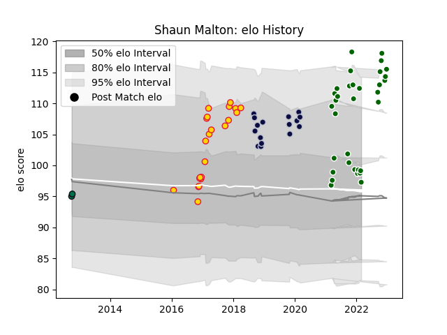

---  
layout: page  
title: Shaun Malton  
date: 2023-03-21 18:27:34.436067  
categories: player  
---
# Shaun Malton

Last updated: 2023-03-21
## Positions: H

## Current elo: 99.0

## Current Percentile: 97.0

# Elo History

# Match History

| Team                |   Appearances |   Win Rate |
|:--------------------|--------------:|-----------:|
| Ealing Trailfinders |            32 |   0.84375  |
| Exeter Chiefs       |            22 |   0.727273 |
| Bristol Rugby       |            16 |   0.625    |
| London Irish        |             2 |   0.5      |

| Opponent           |   Matches |   Win Rate |
|:-------------------|----------:|-----------:|
| Worcester Warriors |         6 |   0.5      |
| Doncaster          |         4 |   0.5      |
| Harlequins         |         4 |   0.5      |
| Bedford            |         4 |   0.75     |
| Nottingham         |         4 |   1        |
| Bath Rugby         |         4 |   1        |
| Coventry           |         4 |   1        |
| Richmond           |         3 |   1        |
| Hartpury College   |         3 |   1        |
| Jersey             |         3 |   1        |
| Saracens           |         3 |   0.333333 |
| Cornish Pirates    |         3 |   0.666667 |
| Wasps              |         3 |   0.666667 |
| Bordeaux Begles    |         3 |   0.333333 |
| Northampton Saints |         3 |   1        |
| Sale Sharks        |         2 |   1        |
| Newcastle Falcons  |         2 |   1        |
| Ampthill           |         2 |   1        |
| Leicester Tigers   |         2 |   0.5      |
| Gloucester Rugby   |         2 |   0.5      |
| Zebre              |         2 |   0.5      |
| London Scottish    |         1 |   1        |
| La Rochelle        |         1 |   1        |
| Exeter Chiefs      |         1 |   0        |
| Scarlets           |         1 |   1        |
| Cardiff Blues      |         1 |   1        |
| Bristol Rugby      |         1 |   1        |