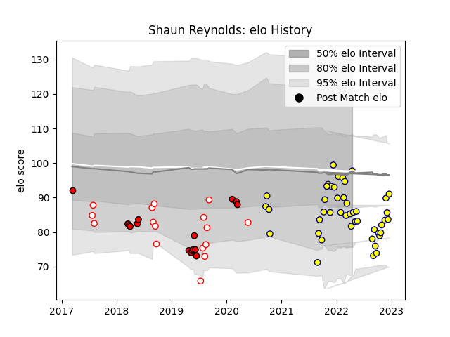

---  
layout: page  
title: Shaun Reynolds  
date: 2022-12-18 16:16:56.501349  
categories: player  
---
# Shaun Reynolds

## Positions: FH

## Current elo: 91.0

## Current Percentile: 19.0

# Elo History

# Match History

| Team         |   Appearances |   Win Rate |
|:-------------|--------------:|-----------:|
| Nevers       |            40 |   0.4875   |
| Lions        |            16 |   0.4375   |
| Golden Lions |            14 |   0.571429 |

| Opponent                 |   Matches |   Win Rate |
|:-------------------------|----------:|-----------:|
| Aurillac                 |         4 |   0.25     |
| Agen                     |         3 |   0.666667 |
| Montauban                |         3 |   0.333333 |
| Griquas                  |         3 |   1        |
| Colomiers                |         3 |   0.333333 |
| Carcassonne              |         3 |   0.333333 |
| Provence Rugby           |         3 |   0.333333 |
| Blue Bulls               |         3 |   0.333333 |
| Pumas                    |         2 |   0.5      |
| Rouen                    |         2 |   1        |
| Soyaux-Angouleme         |         2 |   1        |
| Oyonnax                  |         2 |   0.5      |
| Natal Sharks             |         2 |   0        |
| Narbonne                 |         2 |   1        |
| Stormers                 |         2 |   1        |
| Vannes                   |         2 |   0.5      |
| Mont-de-Marsan           |         2 |   0.5      |
| Western Province         |         2 |   0.5      |
| Grenoble                 |         2 |   0        |
| Free State Cheetahs      |         2 |   1        |
| Crusaders                |         2 |   0        |
| Beziers                  |         2 |   0.5      |
| Jaguares                 |         2 |   0        |
| Massy                    |         1 |   1        |
| Blues                    |         1 |   0        |
| Bayonne                  |         1 |   0        |
| US Bressane              |         1 |   1        |
| Sunwolves                |         1 |   1        |
| Biarritz Olympique       |         1 |   0.5      |
| Sharks                   |         1 |   0        |
| Brumbies                 |         1 |   1        |
| Queensland Reds          |         1 |   1        |
| Bulls                    |         1 |   0        |
| Perpignan                |         1 |   0        |
| New South Wales Waratahs |         1 |   1        |
| Highlanders              |         1 |   1        |
| Hurricanes               |         1 |   0        |
| Melbourne Rebels         |         1 |   0        |