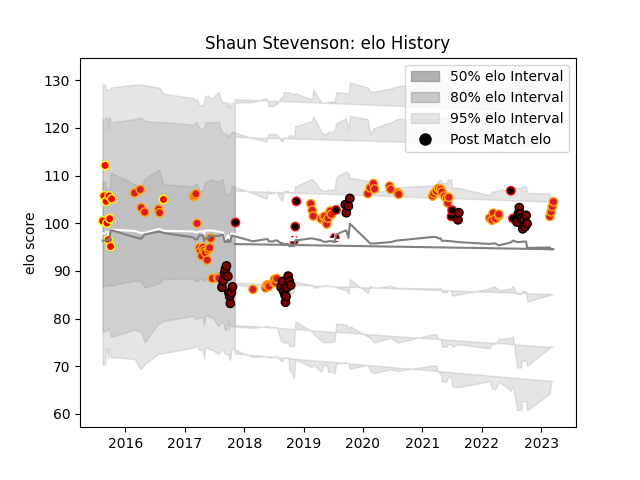

---  
layout: page  
title: Shaun Stevenson  
date: 2023-03-21 18:22:43.950513  
categories: player  
---
# Shaun Stevenson

Last updated: 2023-03-21
## Positions: FB, W

## Country: New Zealand Maori

## Current elo: 100.0

## Current Percentile: 23.0

# Elo History

# Match History

| Team              |   Appearances |   Win Rate |
|:------------------|--------------:|-----------:|
| Chiefs            |            71 |   0.619718 |
| North Harbour     |            38 |   0.578947 |
| Waikato           |            11 |   0.363636 |
| New Zealand Maori |            10 |   0.8      |

| Opponent                 |   Matches |   Win Rate |
|:-------------------------|----------:|-----------:|
| Crusaders                |        11 |   0.363636 |
| Blues                    |         9 |   0.5      |
| Highlanders              |         9 |   0.611111 |
| Hurricanes               |         8 |   0.5      |
| Canterbury               |         6 |   0        |
| Tasman                   |         6 |   0.166667 |
| Counties Manukau         |         5 |   0.8      |
| Auckland                 |         5 |   0.2      |
| Taranaki                 |         4 |   0.75     |
| Stormers                 |         4 |   0.75     |
| New South Wales Waratahs |         4 |   1        |
| Melbourne Rebels         |         4 |   1        |
| Hawke's Bay              |         4 |   0.75     |
| Sharks                   |         3 |   0.666667 |
| Moana Pasifika           |         3 |   1        |
| Queensland Reds          |         3 |   0.666667 |
| Bay of Plenty            |         3 |   0.666667 |
| Wellington               |         3 |   0.333333 |
| Sunwolves                |         3 |   0.666667 |
| Waikato                  |         3 |   0.666667 |
| Southland                |         3 |   1        |
| Brumbies                 |         3 |   0.666667 |
| Northland                |         3 |   1        |
| Samoa                    |         2 |   1        |
| Otago                    |         2 |   0.5      |
| Western Force            |         2 |   1        |
| Manawatu                 |         2 |   1        |
| Ireland                  |         2 |   0.5      |
| Fiji                     |         2 |   0.5      |
| Jaguares                 |         1 |   0        |
| Chile                    |         1 |   1        |
| Cheetahs                 |         1 |   1        |
| Canada                   |         1 |   1        |
| Bulls                    |         1 |   1        |
| United States of America |         1 |   1        |
| British and Irish Lions  |         1 |   0        |
| Brazil                   |         1 |   1        |
| Lions                    |         1 |   0        |