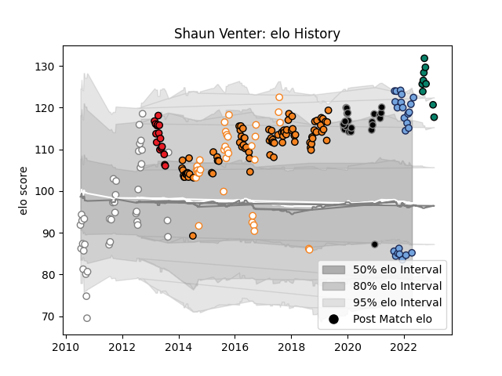

---  
layout: page  
title: Shaun Venter  
date: 2023-02-02 18:58:35.555736  
categories: player  
---
# Shaun Venter

## Positions: SH

## Current elo: 85.0

## Current Percentile: 92.0

# Elo History

# Match History

| Team                |   Appearances |   Win Rate |
|:--------------------|--------------:|-----------:|
| Cheetahs            |            83 |   0.313253 |
| Pumas               |            39 |   0.461538 |
| Free State Cheetahs |            33 |   0.560606 |
| Bayonne             |            24 |   0.666667 |
| Ospreys             |            22 |   0.272727 |
| Southern Kings      |            16 |   0.21875  |
| Montauban           |             9 |   0.444444 |

| Opponent                 |   Matches |   Win Rate |
|:-------------------------|----------:|-----------:|
| Western Province         |         9 |   0.333333 |
| Blue Bulls               |         9 |   0.222222 |
| Golden Lions             |         8 |   0.25     |
| Southern Kings           |         8 |   0.875    |
| Griquas                  |         8 |   0.625    |
| Bulls                    |         8 |   0.125    |
| Natal Sharks             |         8 |   0.375    |
| Stormers                 |         7 |   0.142857 |
| Munster                  |         6 |   0        |
| Sharks                   |         6 |   0.166667 |
| Eastern Province Kings   |         6 |   0.666667 |
| Leopards                 |         5 |   0.8      |
| Glasgow Warriors         |         5 |   0        |
| Lions                    |         4 |   0        |
| Leinster                 |         4 |   0.5      |
| Pumas                    |         4 |   0.625    |
| Ulster                   |         4 |   0.375    |
| Ospreys                  |         4 |   0.25     |
| Zebre                    |         4 |   1        |
| Chiefs                   |         4 |   0.125    |
| Crusaders                |         4 |   0        |
| Cardiff Blues            |         4 |   0.25     |
| New South Wales Waratahs |         3 |   0        |
| Melbourne Rebels         |         3 |   0.333333 |
| Benetton Treviso         |         3 |   0.666667 |
| Western Force            |         3 |   0.666667 |
| Valke                    |         3 |   1        |
| Sunwolves                |         3 |   1        |
| Boland Cavaliers         |         3 |   1        |
| Scarlets                 |         3 |   0.333333 |
| Border Bulldogs          |         3 |   1        |
| Brumbies                 |         3 |   0.5      |
| Nevers                   |         3 |   0.833333 |
| Carcassonne              |         3 |   0.333333 |
| Mont-de-Marsan           |         3 |   0.333333 |
| Agen                     |         3 |   0.833333 |
| Free State Cheetahs      |         3 |   0        |
| Connacht                 |         3 |   0        |
| Cheetahs                 |         3 |   0        |
| Hurricanes               |         3 |   0        |
| Highlanders              |         3 |   0.333333 |
| SWD Eagles               |         2 |   0.5      |
| Montauban                |         2 |   1        |
| Edinburgh                |         2 |   0.5      |
| Beziers                  |         2 |   0.5      |
| Colomiers                |         2 |   0.5      |
| Blues                    |         2 |   0        |
| Grenoble                 |         2 |   0.5      |
| Saracens                 |         2 |   0        |
| Dragons                  |         2 |   0.5      |
| Racing 92                |         2 |   0        |
| Queensland Reds          |         2 |   0        |
| Provence Rugby           |         2 |   0.5      |
| Oyonnax                  |         2 |   0.5      |
| Jaguares                 |         2 |   0        |
| Aurillac                 |         2 |   0.5      |
| Narbonne                 |         2 |   1        |
| Rouen                    |         1 |   1        |
| Griffons                 |         1 |   1        |
| Biarritz Olympique       |         1 |   0        |
| US Bressane              |         1 |   1        |
| Vannes                   |         1 |   1        |
| Castres Olympique        |         1 |   1        |
| Worcester Warriors       |         1 |   1        |
| Massy                    |         1 |   0        |