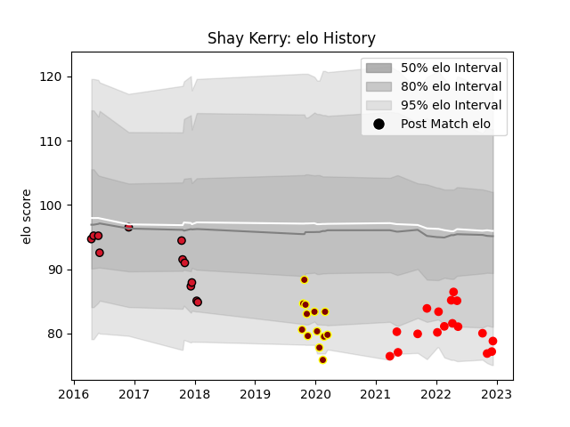

---  
layout: page  
title: Shay Kerry  
date: 2022-12-09 13:11:47.233311  
categories: player  
---
# Shay Kerry

## Positions: L, FL

## Current elo: 77.0

## Current Percentile: 6.0

# Elo History

# Match History

| Team     |   Appearances |   Win Rate |
|:---------|--------------:|-----------:|
| Rouen    |            16 |   0.46875  |
| Ampthill |            13 |   0.653846 |
| Oyonnax  |            12 |   0.25     |

| Opponent           |   Matches |   Win Rate |
|:-------------------|----------:|-----------:|
| Vannes             |         3 |       1    |
| Brive              |         3 |       0    |
| Agen               |         2 |       0    |
| Cornish Pirates    |         2 |       0    |
| Worcester Warriors |         2 |       0.5  |
| US Bressane        |         2 |       0.25 |
| London Scottish    |         2 |       0.75 |
| Hartpury College   |         2 |       1    |
| Yorkshire Carnegie |         2 |       1    |
| Connacht           |         2 |       0    |
| Coventry           |         1 |       1    |
| Bedford            |         1 |       1    |
| Beziers            |         1 |       1    |
| Biarritz Olympique |         1 |       0    |
| Soyaux-Angouleme   |         1 |       1    |
| Provence Rugby     |         1 |       1    |
| Perpignan          |         1 |       1    |
| Oyonnax            |         1 |       0    |
| Nottingham         |         1 |       0    |
| Nevers             |         1 |       0    |
| Narbonne           |         1 |       0    |
| Montauban          |         1 |       1    |
| Lyon               |         1 |       0    |
| Castres Olympique  |         1 |       0    |
| Bayonne            |         1 |       0    |
| Jersey             |         1 |       0    |
| Colomiers          |         1 |       0    |
| Doncaster          |         1 |       1    |
| La Rochelle        |         1 |       1    |