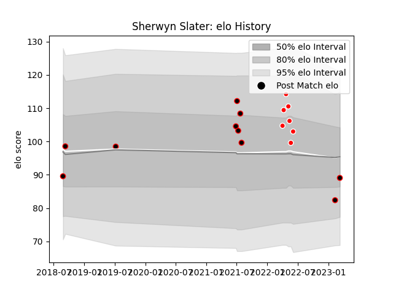

---  
layout: page  
title: Sherwyn Slater  
date: 2023-03-12 11:31:30.750973  
categories: player  
---
# Sherwyn Slater

## Positions: C

## Current elo: 89.0

## Current Percentile: 16.0

# Elo History

# Match History

| Team                   |   Appearances |   Win Rate |
|:-----------------------|--------------:|-----------:|
| Eastern Province Kings |            10 |   0.4      |
| Valke                  |             7 |   0.428571 |

| Opponent               |   Matches |   Win Rate |
|:-----------------------|----------:|-----------:|
| Boland Cavaliers       |         3 |   0.666667 |
| Border Bulldogs        |         3 |   0.666667 |
| Leopards               |         3 |   0        |
| SWD Eagles             |         3 |   0.666667 |
| Griffons               |         2 |   0        |
| Eastern Province Kings |         1 |   0        |
| Tusker Simba           |         1 |   1        |
| Valke                  |         1 |   0        |