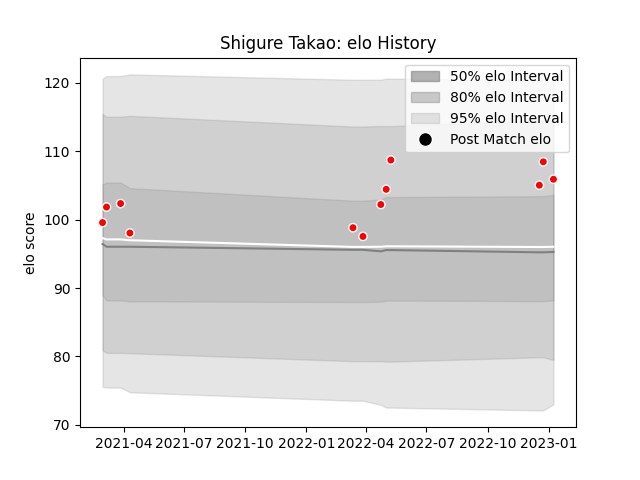

---  
layout: page  
title: Shigure Takao  
date: 2023-02-02 19:14:30.779733  
categories: player  
---
# Shigure Takao

## Positions: P

## Current elo: 95.0

## Current Percentile: 70.0

# Elo History

# Match History

| Team                  |   Appearances |   Win Rate |
|:----------------------|--------------:|-----------:|
| Kobelco Kobe Steelers |            14 |   0.642857 |

| Opponent                          |   Matches |   Win Rate |
|:----------------------------------|----------:|-----------:|
| Yokohama Canon Eagles             |         3 |   0.666667 |
| Black Rams Tokyo                  |         1 |   1        |
| Green Rockets Tokatsu             |         1 |   1        |
| Hanazono Kintetsu Liners          |         1 |   1        |
| Hino Red Dolphins                 |         1 |   1        |
| Kubota Spears Funabashi Tokyo-Bay |         1 |   0        |
| NTT Docomo Red Hurricanes Osaka   |         1 |   1        |
| Shizuoka Blue Revs                |         1 |   1        |
| Tokyo Sungoliath                  |         1 |   0        |
| Toshiba Brave Lupus Tokyo         |         1 |   0        |
| Toyota Verblitz                   |         1 |   0        |
| Urayasu D-Rocks                   |         1 |   1        |