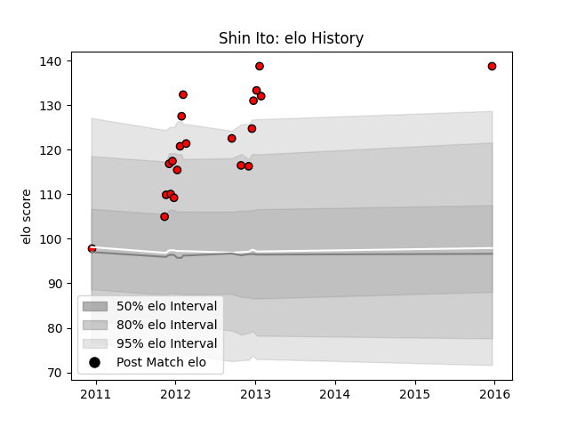

---  
layout: page  
title: Shin Ito  
date: 2023-03-21 18:34:39.718686  
categories: player  
---
# Shin Ito

Last updated: 2023-03-21
## Positions: W

## Current elo: 139.0

## Current Percentile: None

# Elo History

# Match History

| Team                      |   Appearances |   Win Rate |
|:--------------------------|--------------:|-----------:|
| Toshiba Brave Lupus Tokyo |            21 |   0.761905 |

| Opponent                        |   Matches |   Win Rate |
|:--------------------------------|----------:|-----------:|
| Hanazono Kintetsu Liners        |         3 |   1        |
| Kobelco Kobe Steelers           |         3 |   0.666667 |
| Saitama Wild Knights            |         3 |   0.666667 |
| Black Rams Tokyo                |         2 |   0.5      |
| NTT Docomo Red Hurricanes Osaka |         2 |   1        |
| Shizuoka Blue Revs              |         2 |   1        |
| Tokyo Sungoliath                |         2 |   0.5      |
| Green Rockets Tokatsu           |         1 |   0        |
| Kyuden Voltex                   |         1 |   1        |
| Mie Honda Heat                  |         1 |   1        |
| Urayasu D-Rocks                 |         1 |   1        |