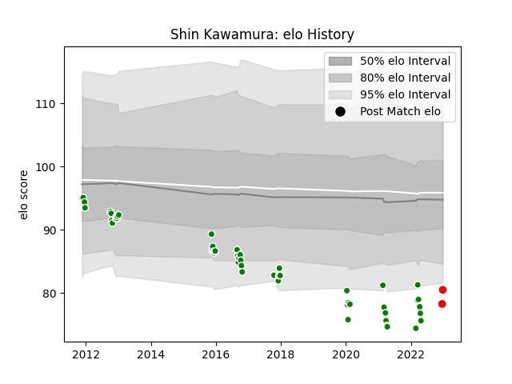

---  
layout: page  
title: Shin Kawamura  
date: 2023-01-13 11:25:09.333712  
categories: player  
---
# Shin Kawamura

## Positions: H

## Current elo: 76.0

## Current Percentile: 9.0

# Elo History

# Match History

| Team                  |   Appearances |   Win Rate |
|:----------------------|--------------:|-----------:|
| Green Rockets Tokatsu |            51 |    0.27451 |
| Yokohama Canon Eagles |             3 |    0.5     |

| Opponent                          |   Matches |   Win Rate |
|:----------------------------------|----------:|-----------:|
| Yokohama Canon Eagles             |         5 |   0.4      |
| Kobelco Kobe Steelers             |         5 |   0.2      |
| Saitama Wild Knights              |         4 |   0        |
| Urayasu D-Rocks                   |         4 |   0.5      |
| Tokyo Sungoliath                  |         4 |   0        |
| Shizuoka Blue Revs                |         4 |   0        |
| Black Rams Tokyo                  |         4 |   0.25     |
| Kubota Spears Funabashi Tokyo-Bay |         4 |   0.5      |
| Munakata Sanix Blues              |         3 |   0.666667 |
| Toshiba Brave Lupus Tokyo         |         3 |   0        |
| Toyota Verblitz                   |         3 |   0.333333 |
| NTT Docomo Red Hurricanes Osaka   |         3 |   0.166667 |
| Toyota Industries Shuttles Aichi  |         2 |   0.5      |
| Hino Red Dolphins                 |         2 |   0        |
| Mitsubishi Dynaboars              |         1 |   0        |
| Coca-Cola Red Sparks              |         1 |   1        |
| Mie Honda Heat                    |         1 |   1        |
| Kyuden Voltex                     |         1 |   1        |