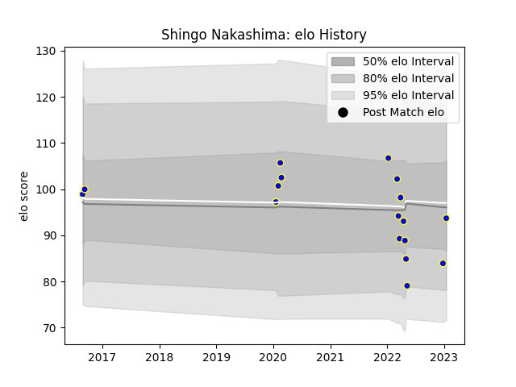

---  
layout: page  
title: Shingo Nakashima  
date: 2022-12-28 12:57:34.999598  
categories: player  
---
# Shingo Nakashima

## Positions: L, FL

## Current elo: 94.0

## Current Percentile: 32.0

# Elo History

# Match History

| Team            |   Appearances |   Win Rate |
|:----------------|--------------:|-----------:|
| Urayasu D-Rocks |            16 |        0.5 |

| Opponent                          |   Matches |   Win Rate |
|:----------------------------------|----------:|-----------:|
| Kobelco Kobe Steelers             |         3 |   0.333333 |
| Black Rams Tokyo                  |         2 |   1        |
| Green Rockets Tokatsu             |         2 |   1        |
| Tokyo Sungoliath                  |         2 |   0        |
| Kubota Spears Funabashi Tokyo-Bay |         1 |   0        |
| Mie Honda Heat                    |         1 |   1        |
| Munakata Sanix Blues              |         1 |   1        |
| Shimizu Blue Sharks               |         1 |   1        |
| Shizuoka Blue Revs                |         1 |   0        |
| Toyota Verblitz                   |         1 |   0        |
| Yokohama Canon Eagles             |         1 |   0        |