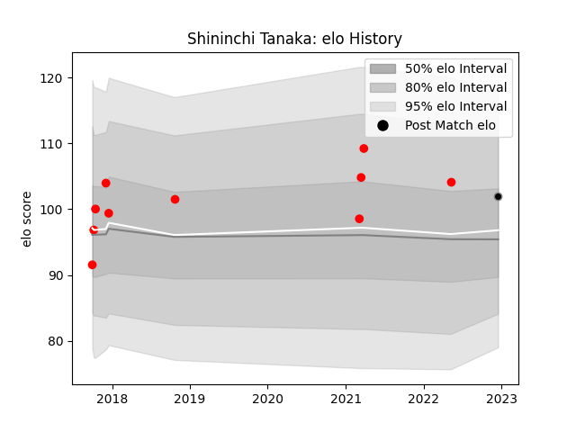

---  
layout: page  
title: Shininchi Tanaka  
date: 2022-12-18 16:32:01.313704  
categories: player  
---
# Shininchi Tanaka

## Positions: FL, L

## Current elo: 102.0

## Current Percentile: 78.0

# Elo History

# Match History

| Team                  |   Appearances |   Win Rate |
|:----------------------|--------------:|-----------:|
| Yokohama Canon Eagles |            10 |        0.7 |
| Black Rams Tokyo      |             1 |        0   |

| Opponent                         |   Matches |   Win Rate |
|:---------------------------------|----------:|-----------:|
| Green Rockets Tokatsu            |         2 |        0.5 |
| Saitama Wild Knights             |         2 |        0   |
| Black Rams Tokyo                 |         1 |        1   |
| Coca-Cola Red Sparks             |         1 |        1   |
| Kobelco Kobe Steelers            |         1 |        1   |
| Mitsubishi Dynaboars             |         1 |        0   |
| Munakata Sanix Blues             |         1 |        1   |
| Shizuoka Blue Revs               |         1 |        1   |
| Toyota Industries Shuttles Aichi |         1 |        1   |