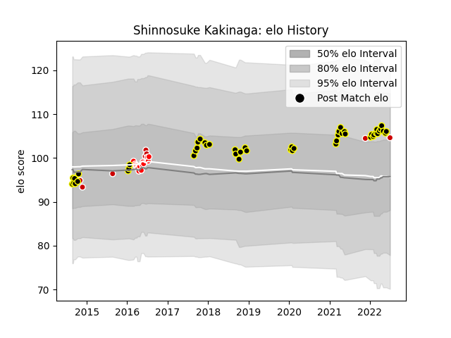

---  
layout: page  
title: Shinnosuke Kakinaga  
date: 2022-12-28 12:53:09.533375  
categories: player  
---
# Shinnosuke Kakinaga

## Positions: P

## Country: Japan

## Current elo: 98.0

## Current Percentile: 66.0

# Elo History

# Match History

| Team             |   Appearances |   Win Rate |
|:-----------------|--------------:|-----------:|
| Tokyo Sungoliath |            26 |   0.769231 |
| Sunwolves        |            15 |   0.1      |
| Japan            |             8 |   0.25     |

| Opponent                          |   Matches |   Win Rate |
|:----------------------------------|----------:|-----------:|
| Black Rams Tokyo                  |         3 |   1        |
| Kobelco Kobe Steelers             |         3 |   0.333333 |
| Toyota Verblitz                   |         3 |   1        |
| Scotland                          |         3 |   0        |
| NTT Docomo Red Hurricanes Osaka   |         3 |   1        |
| Yokohama Canon Eagles             |         2 |   1        |
| Green Rockets Tokatsu             |         2 |   1        |
| Cheetahs                          |         2 |   0        |
| Kubota Spears Funabashi Tokyo-Bay |         2 |   0.5      |
| Bulls                             |         2 |   0        |
| Toshiba Brave Lupus Tokyo         |         2 |   0.5      |
| Stormers                          |         2 |   0.25     |
| Saitama Wild Knights              |         2 |   0        |
| Canada                            |         1 |   1        |
| Western Force                     |         1 |   0        |
| Uruguay                           |         1 |   1        |
| Urayasu D-Rocks                   |         1 |   1        |
| Southern Kings                    |         1 |   0        |
| Shizuoka Blue Revs                |         1 |   1        |
| Sharks                            |         1 |   0        |
| Coca-Cola Red Sparks              |         1 |   1        |
| France                            |         1 |   0        |
| New Zealand Maori                 |         1 |   0        |
| New South Wales Waratahs          |         1 |   0        |
| Brumbies                          |         1 |   0        |
| Melbourne Rebels                  |         1 |   0        |
| Lions                             |         1 |   0        |
| Jaguares                          |         1 |   1        |
| Hanazono Kintetsu Liners          |         1 |   1        |
| Georgia                           |         1 |   0        |
| Queensland Reds                   |         1 |   0        |