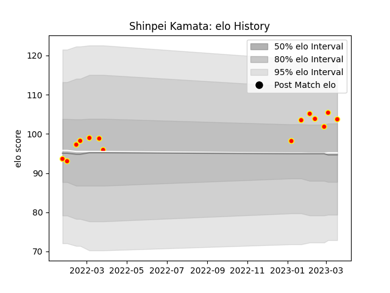

---  
layout: page  
title: Shinpei Kamata  
date: 2023-01-13 11:34:01.404839  
categories: player  
---
# Shinpei Kamata

## Positions: P

## Current elo: 96.0

## Current Percentile: 42.0

# Elo History

# Match History

| Team          |   Appearances |   Win Rate |
|:--------------|--------------:|-----------:|
| Kyuden Voltex |             9 |   0.333333 |

| Opponent                         |   Matches |   Win Rate |
|:---------------------------------|----------:|-----------:|
| Chugoku Red Regulions            |         2 |        1   |
| Munakata Sanix Blues             |         2 |        0   |
| Shimizu Blue Sharks              |         2 |        0.5 |
| Toyota Industries Shuttles Aichi |         2 |        0   |
| NTT Docomo Red Hurricanes Osaka  |         1 |        0   |