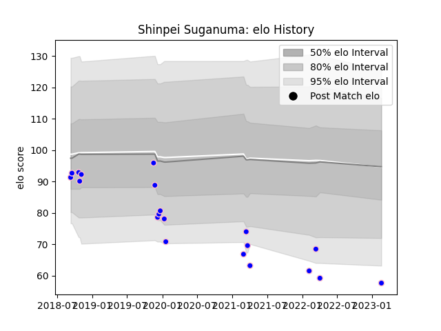

---  
layout: page  
title: Shinpei Suganuma  
date: 2023-02-24 02:34:27.451493  
categories: player  
---
# Shinpei Suganuma

## Positions: FB, FH

## Current elo: 58.0

## Current Percentile: 3.0

# Elo History

# Match History

| Team              |   Appearances |   Win Rate |
|:------------------|--------------:|-----------:|
| Kurita Water Gush |            20 |        0.4 |

| Opponent                         |   Matches |   Win Rate |
|:---------------------------------|----------:|-----------:|
| Kamaishi Seawaves                |         3 |   0.333333 |
| Shimizu Blue Sharks              |         3 |   0.666667 |
| Chugoku Red Regulions            |         2 |   0.5      |
| Hanazono Kintetsu Liners         |         2 |   0        |
| Kyuden Voltex                    |         2 |   1        |
| Mazda Blue Zoomers               |         2 |   1        |
| Coca-Cola Red Sparks             |         1 |   0        |
| Mitsubishi Dynaboars             |         1 |   0        |
| Munakata Sanix Blues             |         1 |   0        |
| NTT Docomo Red Hurricanes Osaka  |         1 |   0        |
| Skyactivs Hiroshima              |         1 |   0        |
| Toyota Industries Shuttles Aichi |         1 |   0        |