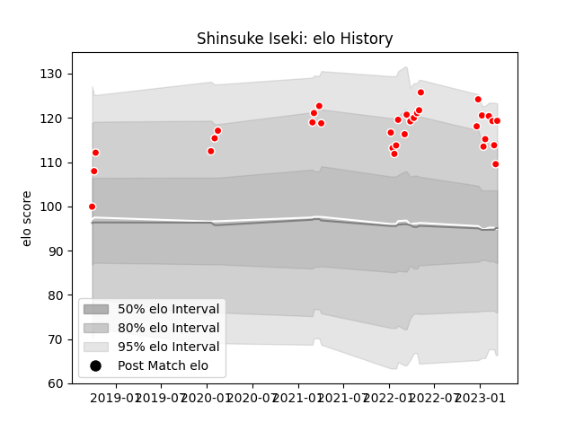

---  
layout: page  
title: Shinsuke Iseki  
date: 2023-03-17 17:39:10.750849  
categories: player  
---
# Shinsuke Iseki

## Positions: W, FB

## Current elo: 119.0

## Current Percentile: 85.0

# Elo History

# Match History

| Team                  |   Appearances |   Win Rate |
|:----------------------|--------------:|-----------:|
| Kobelco Kobe Steelers |            32 |   0.609375 |

| Opponent                          |   Matches |   Win Rate |
|:----------------------------------|----------:|-----------:|
| Yokohama Canon Eagles             |         4 |   0.5      |
| Black Rams Tokyo                  |         3 |   0.666667 |
| Green Rockets Tokatsu             |         3 |   1        |
| Kubota Spears Funabashi Tokyo-Bay |         3 |   0.333333 |
| Saitama Wild Knights              |         3 |   0.166667 |
| Shizuoka Blue Revs                |         3 |   1        |
| Hino Red Dolphins                 |         2 |   1        |
| Tokyo Sungoliath                  |         2 |   0        |
| Toshiba Brave Lupus Tokyo         |         2 |   0        |
| Urayasu D-Rocks                   |         2 |   0.5      |
| Hanazono Kintetsu Liners          |         1 |   1        |
| Mitsubishi Dynaboars              |         1 |   1        |
| Munakata Sanix Blues              |         1 |   1        |
| NTT Docomo Red Hurricanes Osaka   |         1 |   1        |
| Toyota Industries Shuttles Aichi  |         1 |   1        |