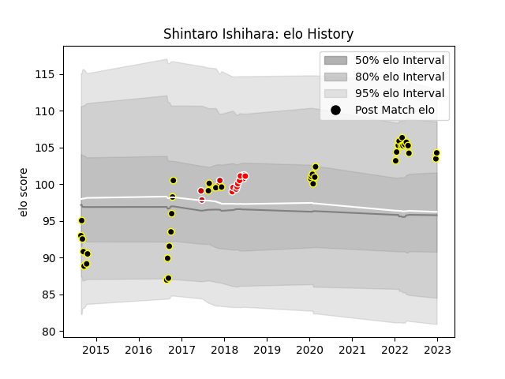

---  
layout: page  
title: Shintaro Ishihara  
date: 2023-01-13 11:24:08.793697  
categories: player  
---
# Shintaro Ishihara

## Positions: P

## Country: Japan

## Current elo: 112.0

## Current Percentile: 86.0

# Elo History

# Match History

| Team             |   Appearances |   Win Rate |
|:-----------------|--------------:|-----------:|
| Tokyo Sungoliath |            39 |   0.820513 |
| Sunwolves        |             8 |   0.375    |
| Japan            |             7 |   0.5      |

| Opponent                          |   Matches |   Win Rate |
|:----------------------------------|----------:|-----------:|
| Black Rams Tokyo                  |         5 |   1        |
| Yokohama Canon Eagles             |         5 |   1        |
| Green Rockets Tokatsu             |         4 |   1        |
| NTT Docomo Red Hurricanes Osaka   |         3 |   1        |
| Toyota Verblitz                   |         3 |   1        |
| Toshiba Brave Lupus Tokyo         |         3 |   0.333333 |
| Kobelco Kobe Steelers             |         3 |   0.333333 |
| Saitama Wild Knights              |         3 |   0.333333 |
| Kubota Spears Funabashi Tokyo-Bay |         2 |   0.5      |
| Hanazono Kintetsu Liners          |         2 |   1        |
| Ireland                           |         2 |   0        |
| Italy                             |         2 |   0.5      |
| Urayasu D-Rocks                   |         1 |   1        |
| Toyota Industries Shuttles Aichi  |         1 |   1        |
| Tonga                             |         1 |   1        |
| Stormers                          |         1 |   1        |
| Sharks                            |         1 |   0        |
| Queensland Reds                   |         1 |   1        |
| Bulls                             |         1 |   1        |
| Munakata Sanix Blues              |         1 |   1        |
| Mie Honda Heat                    |         1 |   1        |
| Coca-Cola Red Sparks              |         1 |   1        |
| Blues                             |         1 |   0        |
| Hurricanes                        |         1 |   0        |
| Hino Red Dolphins                 |         1 |   1        |
| Georgia                           |         1 |   1        |
| France                            |         1 |   0.5      |
| Crusaders                         |         1 |   0        |
| Lions                             |         1 |   0        |