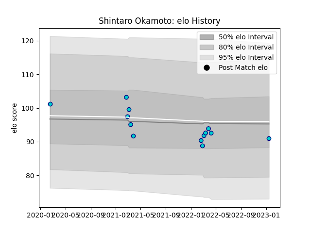

---  
layout: page  
title: Shintaro Okamoto  
date: 2023-01-15 12:02:22.317834  
categories: player  
---
# Shintaro Okamoto

## Positions: P

## Current elo: 91.0

## Current Percentile: None

# Elo History

# Match History

| Team               |   Appearances |   Win Rate |
|:-------------------|--------------:|-----------:|
| Shizuoka Blue Revs |            13 |   0.461538 |

| Opponent                          |   Matches |   Win Rate |
|:----------------------------------|----------:|-----------:|
| Black Rams Tokyo                  |         3 |   0.333333 |
| Green Rockets Tokatsu             |         2 |   1        |
| Yokohama Canon Eagles             |         2 |   0        |
| Hino Red Dolphins                 |         1 |   1        |
| Kobelco Kobe Steelers             |         1 |   0        |
| Kubota Spears Funabashi Tokyo-Bay |         1 |   0        |
| NTT Docomo Red Hurricanes Osaka   |         1 |   1        |
| Saitama Wild Knights              |         1 |   0        |
| Urayasu D-Rocks                   |         1 |   1        |