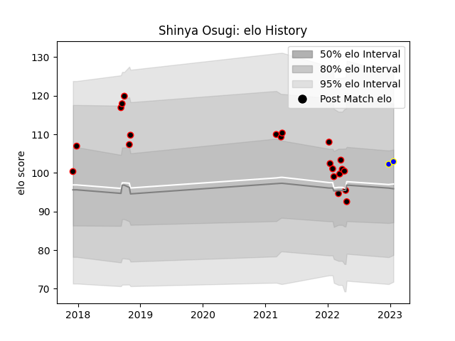

---  
layout: page  
title: Shinya Osugi  
date: 2023-03-21 18:49:50.350726  
categories: player  
---
# Shinya Osugi

Last updated: 2023-03-21
## Positions: FL, L

## Current elo: 121.0

## Current Percentile: 90.0

# Elo History

# Match History

| Team                            |   Appearances |   Win Rate |
|:--------------------------------|--------------:|-----------:|
| NTT Docomo Red Hurricanes Osaka |            31 |   0.387097 |
| Urayasu D-Rocks                 |             3 |   1        |

| Opponent                          |   Matches |   Win Rate |
|:----------------------------------|----------:|-----------:|
| Black Rams Tokyo                  |         3 |   0.333333 |
| Toshiba Brave Lupus Tokyo         |         3 |   0        |
| Tokyo Sungoliath                  |         3 |   0        |
| Kobelco Kobe Steelers             |         2 |   0        |
| Toyota Verblitz                   |         2 |   0        |
| Shizuoka Blue Revs                |         2 |   0        |
| Kubota Spears Funabashi Tokyo-Bay |         2 |   0        |
| Yokohama Canon Eagles             |         2 |   0.5      |
| Hanazono Kintetsu Liners          |         2 |   0.5      |
| Green Rockets Tokatsu             |         2 |   1        |
| Kamaishi Seawaves                 |         1 |   1        |
| Kurita Water Gush                 |         1 |   1        |
| Chugoku Red Regulions             |         1 |   1        |
| Mitsubishi Dynaboars              |         1 |   1        |
| Munakata Sanix Blues              |         1 |   1        |
| Saitama Wild Knights              |         1 |   0        |
| Shimizu Blue Sharks               |         1 |   1        |
| Hino Red Dolphins                 |         1 |   1        |
| Toyota Industries Shuttles Aichi  |         1 |   1        |
| Coca-Cola Red Sparks              |         1 |   1        |
| Mazda Blue Zoomers                |         1 |   1        |