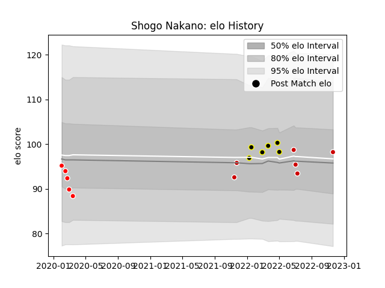

---  
layout: page  
title: Shogo Nakano  
date: 2023-01-13 11:34:36.408569  
categories: player  
---
# Shogo Nakano

## Positions: C, W

## Country: Japan

## Current elo: 99.0

## Current Percentile: 55.0

# Elo History

# Match History

| Team             |   Appearances |   Win Rate |
|:-----------------|--------------:|-----------:|
| Tokyo Sungoliath |            10 |   0.7      |
| Japan            |             6 |   0.333333 |
| Sunwolves        |             5 |   0.2      |

| Opponent                          |   Matches |   Win Rate |
|:----------------------------------|----------:|-----------:|
| France                            |         3 |        0   |
| Kubota Spears Funabashi Tokyo-Bay |         2 |        0.5 |
| Toshiba Brave Lupus Tokyo         |         2 |        0.5 |
| Black Rams Tokyo                  |         1 |        1   |
| Saitama Wild Knights              |         1 |        0   |
| Uruguay                           |         1 |        1   |
| Urayasu D-Rocks                   |         1 |        1   |
| Toyota Verblitz                   |         1 |        1   |
| Scotland                          |         1 |        0   |
| Portugal                          |         1 |        1   |
| Queensland Reds                   |         1 |        0   |
| Chiefs                            |         1 |        0   |
| Melbourne Rebels                  |         1 |        1   |
| Hurricanes                        |         1 |        0   |
| Green Rockets Tokatsu             |         1 |        1   |
| Crusaders                         |         1 |        0   |
| Yokohama Canon Eagles             |         1 |        1   |