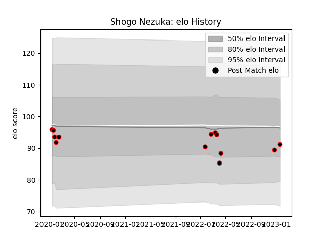

---  
layout: page  
title: Shogo Nezuka  
date: 2023-01-21 15:41:20.852721  
categories: player  
---
# Shogo Nezuka

## Positions: SH

## Current elo: 91.0

## Current Percentile: 20.0

# Elo History

# Match History

| Team           |   Appearances |   Win Rate |
|:---------------|--------------:|-----------:|
| Mie Honda Heat |            13 |   0.615385 |

| Opponent                          |   Matches |   Win Rate |
|:----------------------------------|----------:|-----------:|
| Hanazono Kintetsu Liners          |         2 |          0 |
| Kamaishi Seawaves                 |         2 |          1 |
| Skyactivs Hiroshima               |         2 |          1 |
| Black Rams Tokyo                  |         1 |          1 |
| Kubota Spears Funabashi Tokyo-Bay |         1 |          0 |
| Mitsubishi Dynaboars              |         1 |          1 |
| Shimizu Blue Sharks               |         1 |          1 |
| Toshiba Brave Lupus Tokyo         |         1 |          0 |
| Toyota Verblitz                   |         1 |          0 |
| Yokohama Canon Eagles             |         1 |          1 |