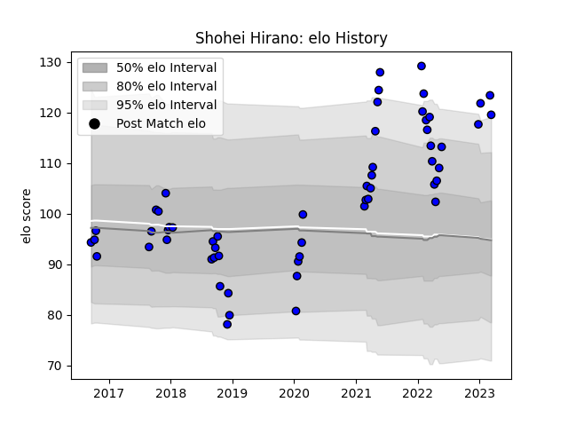

---  
layout: page  
title: Shohei Hirano  
date: 2022-12-31 16:27:41.435482  
categories: player  
---
# Shohei Hirano

## Positions: P

## Current elo: 112.0

## Current Percentile: 95.0

# Elo History

# Match History

| Team                 |   Appearances |   Win Rate |
|:---------------------|--------------:|-----------:|
| Saitama Wild Knights |            45 |   0.944444 |

| Opponent                          |   Matches |   Win Rate |
|:----------------------------------|----------:|-----------:|
| Yokohama Canon Eagles             |         7 |   1        |
| Shizuoka Blue Revs                |         5 |   1        |
| Black Rams Tokyo                  |         4 |   0.75     |
| Kobelco Kobe Steelers             |         3 |   0.833333 |
| Kubota Spears Funabashi Tokyo-Bay |         3 |   1        |
| Coca-Cola Red Sparks              |         3 |   1        |
| Green Rockets Tokatsu             |         3 |   1        |
| Tokyo Sungoliath                  |         3 |   0.666667 |
| Toshiba Brave Lupus Tokyo         |         3 |   1        |
| NTT Docomo Red Hurricanes Osaka   |         2 |   1        |
| Toyota Verblitz                   |         2 |   1        |
| Urayasu D-Rocks                   |         2 |   1        |
| Hino Red Dolphins                 |         1 |   1        |
| Mie Honda Heat                    |         1 |   1        |
| Mitsubishi Dynaboars              |         1 |   1        |
| Toyota Industries Shuttles Aichi  |         1 |   1        |
| Munakata Sanix Blues              |         1 |   1        |