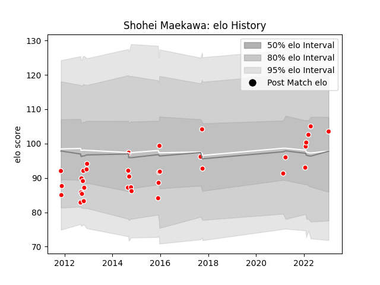

---  
layout: page  
title: Shohei Maekawa  
date: 2023-01-17 11:32:36.770248  
categories: player  
---
# Shohei Maekawa

## Positions: FL, N8

## Current elo: 104.0

## Current Percentile: 53.0

# Elo History

# Match History

| Team                  |   Appearances |   Win Rate |
|:----------------------|--------------:|-----------:|
| Kobelco Kobe Steelers |            35 |   0.742857 |

| Opponent                          |   Matches |   Win Rate |
|:----------------------------------|----------:|-----------:|
| Green Rockets Tokatsu             |         4 |   1        |
| Shizuoka Blue Revs                |         4 |   1        |
| Black Rams Tokyo                  |         3 |   1        |
| Hanazono Kintetsu Liners          |         3 |   0.666667 |
| NTT Docomo Red Hurricanes Osaka   |         3 |   0.666667 |
| Toyota Verblitz                   |         3 |   0.333333 |
| Yokohama Canon Eagles             |         3 |   0.666667 |
| Coca-Cola Red Sparks              |         2 |   1        |
| Munakata Sanix Blues              |         2 |   1        |
| Saitama Wild Knights              |         2 |   0        |
| Urayasu D-Rocks                   |         2 |   0.5      |
| Kubota Spears Funabashi Tokyo-Bay |         1 |   1        |
| Kyuden Voltex                     |         1 |   1        |
| Tokyo Sungoliath                  |         1 |   0        |
| Toyota Industries Shuttles Aichi  |         1 |   1        |