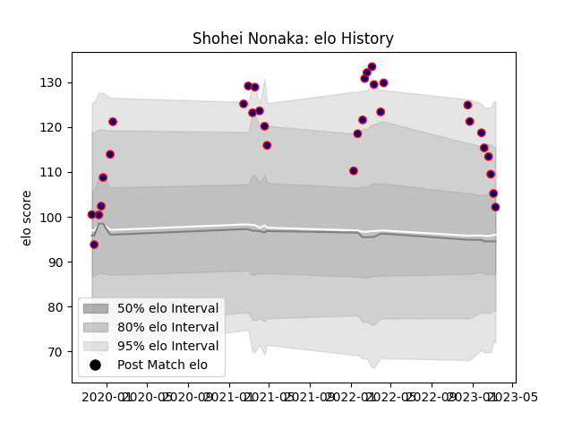

---  
layout: page  
title: Shohei Nonaka  
date: 2023-03-17 17:34:18.788550  
categories: player  
---
# Shohei Nonaka

## Positions: FL, N8

## Current elo: 102.0

## Current Percentile: 77.0

# Elo History

# Match History

| Team                     |   Appearances |   Win Rate |
|:-------------------------|--------------:|-----------:|
| Hanazono Kintetsu Liners |            31 |   0.612903 |

| Opponent                         |   Matches |   Win Rate |
|:---------------------------------|----------:|-----------:|
| Kamaishi Seawaves                |         4 |        1   |
| Mitsubishi Dynaboars             |         3 |        0   |
| Saitama Wild Knights             |         2 |        0   |
| Toyota Industries Shuttles Aichi |         2 |        0.5 |
| Hino Red Dolphins                |         2 |        1   |
| Kurita Water Gush                |         2 |        1   |
| Skyactivs Hiroshima              |         2 |        1   |
| Coca-Cola Red Sparks             |         2 |        1   |
| Shimizu Blue Sharks              |         2 |        1   |
| Black Rams Tokyo                 |         1 |        0   |
| Toshiba Brave Lupus Tokyo        |         1 |        0   |
| Shizuoka Blue Revs               |         1 |        0   |
| Mie Honda Heat                   |         1 |        1   |
| Munakata Sanix Blues             |         1 |        1   |
| Mazda Blue Zoomers               |         1 |        1   |
| Kyuden Voltex                    |         1 |        1   |
| Kobelco Kobe Steelers            |         1 |        0   |
| Green Rockets Tokatsu            |         1 |        0   |
| Toyota Verblitz                  |         1 |        0   |