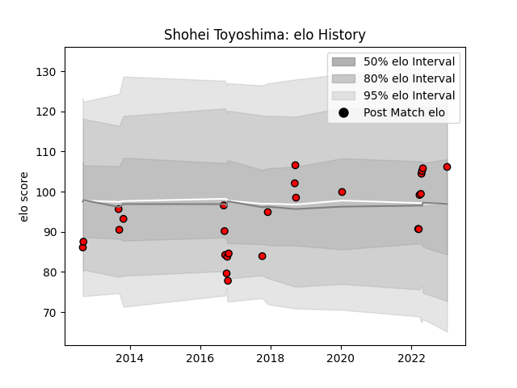

---  
layout: page  
title: Shohei Toyoshima  
date: 2023-03-21 17:58:09.484868  
categories: player  
---
# Shohei Toyoshima

Last updated: 2023-03-21
## Positions: W, FB

## Current elo: 112.0

## Current Percentile: 90.0

# Elo History

# Match History

| Team                      |   Appearances |   Win Rate |
|:--------------------------|--------------:|-----------:|
| Toshiba Brave Lupus Tokyo |            55 |   0.618182 |

| Opponent                          |   Matches |   Win Rate |
|:----------------------------------|----------:|-----------:|
| Kubota Spears Funabashi Tokyo-Bay |         6 |   0.333333 |
| Green Rockets Tokatsu             |         5 |   0.8      |
| Toyota Verblitz                   |         5 |   0.6      |
| Black Rams Tokyo                  |         4 |   0.5      |
| Tokyo Sungoliath                  |         4 |   0.5      |
| Yokohama Canon Eagles             |         4 |   0.75     |
| Kobelco Kobe Steelers             |         4 |   0.5      |
| Hanazono Kintetsu Liners          |         4 |   1        |
| Coca-Cola Red Sparks              |         3 |   1        |
| Shizuoka Blue Revs                |         3 |   0.666667 |
| Mie Honda Heat                    |         2 |   1        |
| Mitsubishi Dynaboars              |         2 |   0.5      |
| Saitama Wild Knights              |         2 |   0        |
| Urayasu D-Rocks                   |         2 |   0.5      |
| Munakata Sanix Blues              |         2 |   0.5      |
| NTT Docomo Red Hurricanes Osaka   |         1 |   1        |
| Hino Red Dolphins                 |         1 |   1        |
| Toyota Industries Shuttles Aichi  |         1 |   0        |