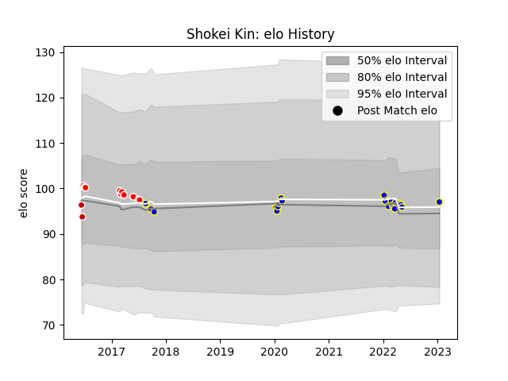

---  
layout: page  
title: Shokei Kin  
date: 2023-01-15 11:41:40.637323  
categories: player  
---
# Shokei Kin

## Positions: FL

## Country: Japan

## Current elo: 97.0

## Current Percentile: 52.0

# Elo History

# Match History

| Team            |   Appearances |   Win Rate |
|:----------------|--------------:|-----------:|
| Urayasu D-Rocks |            21 |   0.428571 |
| Sunwolves       |             9 |   0        |
| Japan           |             3 |   0.333333 |

| Opponent                          |   Matches |   Win Rate |
|:----------------------------------|----------:|-----------:|
| Black Rams Tokyo                  |         3 |   0.666667 |
| Kubota Spears Funabashi Tokyo-Bay |         3 |   0        |
| Scotland                          |         2 |   0        |
| Cheetahs                          |         2 |   0        |
| Toyota Industries Shuttles Aichi  |         2 |   1        |
| Kobelco Kobe Steelers             |         2 |   0.5      |
| Tokyo Sungoliath                  |         2 |   0        |
| Stormers                          |         2 |   0        |
| Shizuoka Blue Revs                |         2 |   0        |
| Toyota Verblitz                   |         1 |   0        |
| Toshiba Brave Lupus Tokyo         |         1 |   1        |
| Southern Kings                    |         1 |   0        |
| New South Wales Waratahs          |         1 |   0        |
| Saitama Wild Knights              |         1 |   0        |
| Bulls                             |         1 |   0        |
| Munakata Sanix Blues              |         1 |   1        |
| Mie Honda Heat                    |         1 |   1        |
| Lions                             |         1 |   0        |
| Hurricanes                        |         1 |   0        |
| Hino Red Dolphins                 |         1 |   1        |
| Canada                            |         1 |   1        |
| Yokohama Canon Eagles             |         1 |   0        |