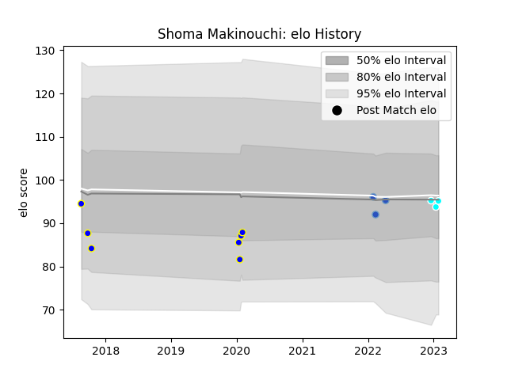

---  
layout: page  
title: Shoma Makinouchi  
date: 2023-01-15 11:54:29.391202  
categories: player  
---
# Shoma Makinouchi

## Positions: L, FL

## Current elo: 94.0

## Current Percentile: 49.0

# Elo History

# Match History

| Team                             |   Appearances |   Win Rate |
|:---------------------------------|--------------:|-----------:|
| Urayasu D-Rocks                  |             7 |   0.428571 |
| Munakata Sanix Blues             |             3 |   0.666667 |
| Toyota Industries Shuttles Aichi |             2 |   0.5      |

| Opponent                          |   Matches |   Win Rate |
|:----------------------------------|----------:|-----------:|
| Black Rams Tokyo                  |         2 |        0.5 |
| Shimizu Blue Sharks               |         2 |        0.5 |
| Chugoku Red Regulions             |         1 |        1   |
| Hino Red Dolphins                 |         1 |        1   |
| Kubota Spears Funabashi Tokyo-Bay |         1 |        0   |
| Kyuden Voltex                     |         1 |        1   |
| Shizuoka Blue Revs                |         1 |        0   |
| Tokyo Sungoliath                  |         1 |        0   |
| Toyota Industries Shuttles Aichi  |         1 |        1   |
| Urayasu D-Rocks                   |         1 |        0   |