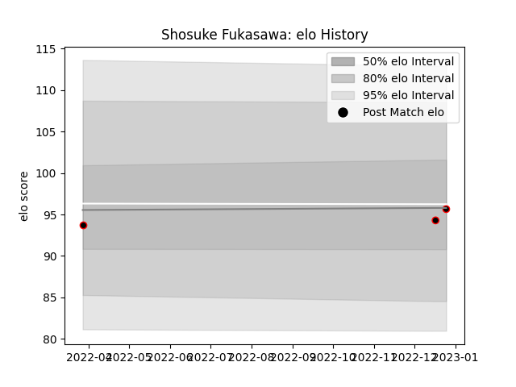

---  
layout: page  
title: Shosuke Fukasawa  
date: 2023-01-17 11:32:07.911905  
categories: player  
---
# Shosuke Fukasawa

## Positions: P

## Current elo: 94.0

## Current Percentile: 63.0

# Elo History

# Match History

| Team                            |   Appearances |   Win Rate |
|:--------------------------------|--------------:|-----------:|
| NTT Docomo Red Hurricanes Osaka |             4 |       0.75 |

| Opponent                          |   Matches |   Win Rate |
|:----------------------------------|----------:|-----------:|
| Chugoku Red Regulions             |         1 |          1 |
| Kubota Spears Funabashi Tokyo-Bay |         1 |          0 |
| Kyuden Voltex                     |         1 |          1 |
| Skyactivs Hiroshima               |         1 |          1 |