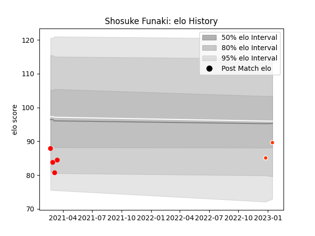

---  
layout: page  
title: Shosuke Funaki  
date: 2023-01-17 11:41:06.649248  
categories: player  
---
# Shosuke Funaki

## Positions: P

## Current elo: 90.0

## Current Percentile: None

# Elo History

# Match History

| Team                  |   Appearances |   Win Rate |
|:----------------------|--------------:|-----------:|
| Yokohama Canon Eagles |             4 |       0.25 |
| Hino Red Dolphins     |             2 |       0    |

| Opponent                         |   Matches |   Win Rate |
|:---------------------------------|----------:|-----------:|
| Kobelco Kobe Steelers            |         1 |          0 |
| Mie Honda Heat                   |         1 |          0 |
| NTT Docomo Red Hurricanes Osaka  |         1 |          0 |
| Saitama Wild Knights             |         1 |          0 |
| Shizuoka Blue Revs               |         1 |          1 |
| Toyota Industries Shuttles Aichi |         1 |          0 |