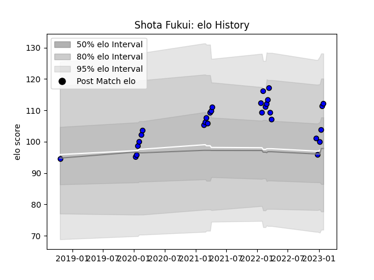

---  
layout: page  
title: Shota Fukui  
date: 2023-01-13 11:28:16.605887  
categories: player  
---
# Shota Fukui

## Positions: FL, N8

## Current elo: 100.0

## Current Percentile: 48.0

# Elo History

# Match History

| Team                 |   Appearances |   Win Rate |
|:---------------------|--------------:|-----------:|
| Saitama Wild Knights |            26 |   0.980769 |

| Opponent                          |   Matches |   Win Rate |
|:----------------------------------|----------:|-----------:|
| Yokohama Canon Eagles             |         4 |       1    |
| NTT Docomo Red Hurricanes Osaka   |         3 |       1    |
| Shizuoka Blue Revs                |         3 |       1    |
| Toshiba Brave Lupus Tokyo         |         3 |       1    |
| Black Rams Tokyo                  |         2 |       1    |
| Kobelco Kobe Steelers             |         2 |       0.75 |
| Mitsubishi Dynaboars              |         2 |       1    |
| Toyota Verblitz                   |         2 |       1    |
| Green Rockets Tokatsu             |         1 |       1    |
| Hino Red Dolphins                 |         1 |       1    |
| Kubota Spears Funabashi Tokyo-Bay |         1 |       1    |
| Tokyo Sungoliath                  |         1 |       1    |
| Urayasu D-Rocks                   |         1 |       1    |