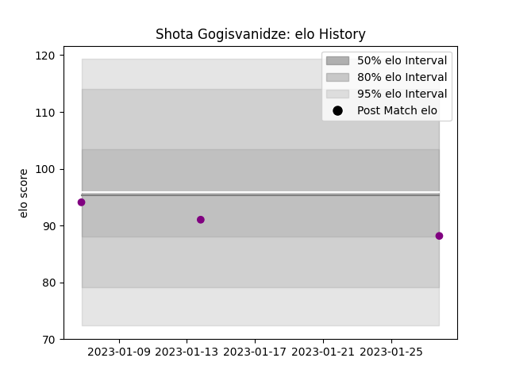

---  
layout: page  
title: Shota Gogisvanidze  
date: 2023-03-21 18:28:48.090467  
categories: player  
---
# Shota Gogisvanidze

Last updated: 2023-03-21
## Positions: P

## Current elo: 107.0

## Current Percentile: 85.0

# Elo History

# Match History

| Team             |   Appearances |   Win Rate |
|:-----------------|--------------:|-----------:|
| Soyaux-Angouleme |            10 |        0.4 |

| Opponent    |   Matches |   Win Rate |
|:------------|----------:|-----------:|
| Beziers     |         2 |          0 |
| Agen        |         1 |          0 |
| Carcassonne |         1 |          1 |
| Colomiers   |         1 |          0 |
| Grenoble    |         1 |          1 |
| Massy       |         1 |          1 |
| Montauban   |         1 |          1 |
| Nevers      |         1 |          0 |
| Rouen       |         1 |          0 |