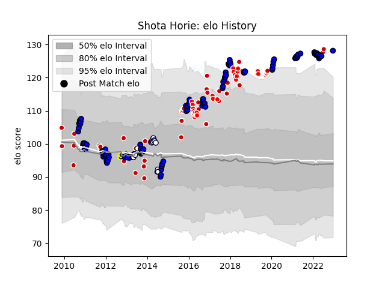

---  
layout: page  
title: Shota Horie  
date: 2022-12-18 16:28:38.814623  
categories: player  
---
# Shota Horie

## Positions: H

## Country: Japan

## Current elo: 124.0

## Current Percentile: 98.0

# Elo History

# Match History

| Team                 |   Appearances |   Win Rate |
|:---------------------|--------------:|-----------:|
| Japan                |            47 |   0.574468 |
| Saitama Wild Knights |            45 |   0.855556 |
| Melbourne Rebels     |            28 |   0.25     |
| Sunwolves            |            26 |   0.134615 |

| Opponent                          |   Matches |   Win Rate |
|:----------------------------------|----------:|-----------:|
| Shizuoka Blue Revs                |         7 |   0.785714 |
| Brumbies                          |         6 |   0.166667 |
| Queensland Reds                   |         6 |   0.166667 |
| Scotland                          |         5 |   0.2      |
| Western Force                     |         5 |   0.6      |
| Yokohama Canon Eagles             |         4 |   0.75     |
| Georgia                           |         4 |   1        |
| Stormers                          |         4 |   0.625    |
| Samoa                             |         4 |   0.75     |
| New South Wales Waratahs          |         4 |   0.25     |
| Toyota Verblitz                   |         4 |   0.75     |
| Hanazono Kintetsu Liners          |         4 |   1        |
| Kobelco Kobe Steelers             |         4 |   1        |
| Tokyo Sungoliath                  |         4 |   0.25     |
| Uruguay                           |         3 |   1        |
| Black Rams Tokyo                  |         3 |   1        |
| Toshiba Brave Lupus Tokyo         |         3 |   1        |
| Southern Kings                    |         3 |   0        |
| Sharks                            |         3 |   0        |
| Canada                            |         3 |   0.833333 |
| Cheetahs                          |         3 |   0        |
| Chiefs                            |         3 |   0        |
| France                            |         3 |   0.166667 |
| Italy                             |         3 |   0.666667 |
| Highlanders                       |         3 |   0.333333 |
| Hurricanes                        |         3 |   0        |
| Tonga                             |         3 |   0.666667 |
| Wales                             |         3 |   0.333333 |
| Ireland                           |         3 |   0.333333 |
| Lions                             |         2 |   0        |
| Fiji                              |         2 |   0        |
| South Africa                      |         2 |   0.5      |
| Blues                             |         2 |   0        |
| Bulls                             |         2 |   0        |
| Russia                            |         2 |   1        |
| Melbourne Rebels                  |         2 |   0        |
| Romania                           |         2 |   1        |
| Green Rockets Tokatsu             |         2 |   1        |
| Munakata Sanix Blues              |         2 |   1        |
| Urayasu D-Rocks                   |         2 |   1        |
| Crusaders                         |         2 |   0        |
| Toyota Industries Shuttles Aichi  |         1 |   1        |
| United States of America          |         1 |   1        |
| Argentina                         |         1 |   0        |
| Spain                             |         1 |   1        |
| New Zealand                       |         1 |   0        |
| NTT Docomo Red Hurricanes Osaka   |         1 |   1        |
| Australia                         |         1 |   0        |
| Mie Honda Heat                    |         1 |   1        |
| Kubota Spears Funabashi Tokyo-Bay |         1 |   1        |
| Jaguares                          |         1 |   1        |
| Coca-Cola Red Sparks              |         1 |   1        |
| Mitsubishi Dynaboars              |         1 |   1        |