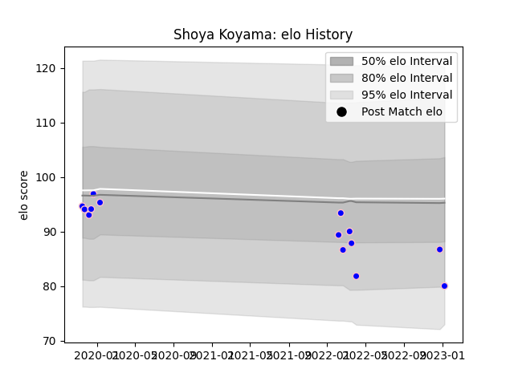

---  
layout: page  
title: Shoya Koyama  
date: 2023-01-13 11:35:01.599886  
categories: player  
---
# Shoya Koyama

## Positions: P

## Current elo: 80.0

## Current Percentile: 21.0

# Elo History

# Match History

| Team              |   Appearances |   Win Rate |
|:------------------|--------------:|-----------:|
| Kurita Water Gush |            14 |   0.357143 |

| Opponent                         |   Matches |   Win Rate |
|:---------------------------------|----------:|-----------:|
| Chugoku Red Regulions            |         2 |        0.5 |
| Kyuden Voltex                    |         2 |        0.5 |
| Munakata Sanix Blues             |         2 |        0   |
| Shimizu Blue Sharks              |         2 |        0.5 |
| Toyota Industries Shuttles Aichi |         2 |        0   |
| Coca-Cola Red Sparks             |         1 |        0   |
| Kamaishi Seawaves                |         1 |        0   |
| Mazda Blue Zoomers               |         1 |        1   |
| Skyactivs Hiroshima              |         1 |        1   |