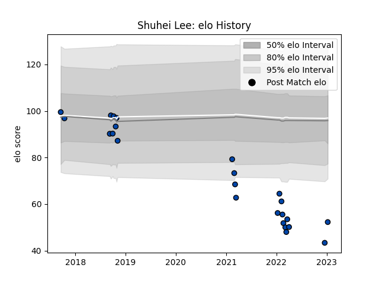

---  
layout: page  
title: Shuhei Lee  
date: 2023-03-21 18:11:56.371079  
categories: player  
---
# Shuhei Lee

Last updated: 2023-03-21
## Positions: C, W

## Current elo: 46.0

## Current Percentile: 0.0

# Elo History

# Match History

| Team                |   Appearances |   Win Rate |
|:--------------------|--------------:|-----------:|
| Skyactivs Hiroshima |            23 |   0.173913 |
| Mazda Blue Zoomers  |             9 |   0.222222 |

| Opponent                         |   Matches |   Win Rate |
|:---------------------------------|----------:|-----------:|
| Kyuden Voltex                    |         6 |   0.166667 |
| Kamaishi Seawaves                |         4 |   0.5      |
| Mitsubishi Dynaboars             |         4 |   0        |
| NTT Docomo Red Hurricanes Osaka  |         4 |   0        |
| Chugoku Red Regulions            |         3 |   0.666667 |
| Hanazono Kintetsu Liners         |         3 |   0        |
| Kurita Water Gush                |         3 |   0.333333 |
| Mie Honda Heat                   |         2 |   0        |
| Coca-Cola Red Sparks             |         1 |   0        |
| Hino Red Dolphins                |         1 |   0        |
| Toyota Industries Shuttles Aichi |         1 |   0        |