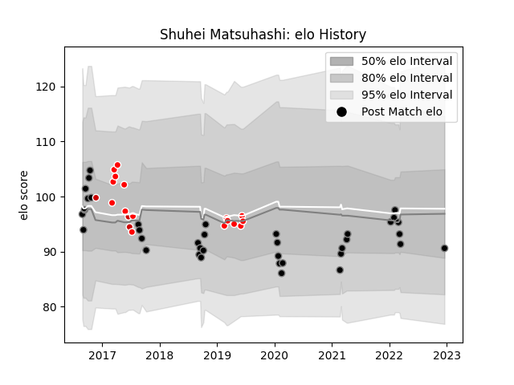

---  
layout: page  
title: Shuhei Matsuhashi  
date: 2022-12-18 16:30:35.392914  
categories: player  
---
# Shuhei Matsuhashi

## Positions: FL, N8

## Country: Japan

## Current elo: 91.0

## Current Percentile: 32.0

# Elo History

# Match History

| Team             |   Appearances |   Win Rate |
|:-----------------|--------------:|-----------:|
| Black Rams Tokyo |            37 |   0.432432 |
| Sunwolves        |            16 |   0.1875   |
| Japan            |             3 |   0        |

| Opponent                          |   Matches |   Win Rate |
|:----------------------------------|----------:|-----------:|
| Shizuoka Blue Revs                |         5 |   0.2      |
| Green Rockets Tokatsu             |         4 |   1        |
| Yokohama Canon Eagles             |         3 |   0.666667 |
| Kobelco Kobe Steelers             |         3 |   0        |
| Urayasu D-Rocks                   |         3 |   0.333333 |
| Tokyo Sungoliath                  |         3 |   0        |
| Stormers                          |         3 |   0        |
| Toyota Verblitz                   |         2 |   0        |
| Toshiba Brave Lupus Tokyo         |         2 |   0.5      |
| Sharks                            |         2 |   0        |
| Saitama Wild Knights              |         2 |   0.5      |
| NTT Docomo Red Hurricanes Osaka   |         2 |   0.5      |
| Blues                             |         2 |   0.5      |
| Ireland                           |         2 |   0        |
| Cheetahs                          |         2 |   0        |
| Bulls                             |         2 |   0.5      |
| Mie Honda Heat                    |         2 |   0.5      |
| Kubota Spears Funabashi Tokyo-Bay |         1 |   0        |
| Brumbies                          |         1 |   0        |
| Mitsubishi Dynaboars              |         1 |   0        |
| Munakata Sanix Blues              |         1 |   1        |
| Jaguares                          |         1 |   0        |
| Hurricanes                        |         1 |   0        |
| Hino Red Dolphins                 |         1 |   1        |
| Southern Kings                    |         1 |   0        |
| Hanazono Kintetsu Liners          |         1 |   1        |
| Coca-Cola Red Sparks              |         1 |   1        |
| Chiefs                            |         1 |   1        |
| Wales                             |         1 |   0        |