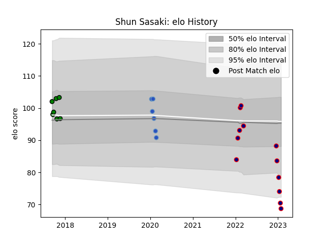

---  
layout: page  
title: Shun Sasaki  
date: 2022-12-28 12:52:42.366327  
categories: player  
---
# Shun Sasaki

## Positions: P

## Current elo: 94.0

## Current Percentile: 56.0

# Elo History

# Match History

| Team                     |   Appearances |   Win Rate |
|:-------------------------|--------------:|-----------:|
| Hanazono Kintetsu Liners |             8 |   0.5      |
| Mitsubishi Dynaboars     |             7 |   0.714286 |
| Munakata Sanix Blues     |             6 |   0.333333 |

| Opponent                          |   Matches |   Win Rate |
|:----------------------------------|----------:|-----------:|
| Green Rockets Tokatsu             |         2 |        0.5 |
| Hino Red Dolphins                 |         2 |        0.5 |
| Kamaishi Seawaves                 |         2 |        1   |
| Mie Honda Heat                    |         2 |        0.5 |
| Mitsubishi Dynaboars              |         2 |        0   |
| Black Rams Tokyo                  |         1 |        0   |
| Chubu Electric Power              |         1 |        1   |
| Chugoku Red Regulions             |         1 |        1   |
| Kobelco Kobe Steelers             |         1 |        0   |
| Kubota Spears Funabashi Tokyo-Bay |         1 |        0   |
| Kyuden Voltex                     |         1 |        1   |
| Mazda Blue Zoomers                |         1 |        1   |
| NTT Docomo Red Hurricanes Osaka   |         1 |        1   |
| Skyactivs Hiroshima               |         1 |        1   |
| Urayasu D-Rocks                   |         1 |        0   |
| Yokohama Canon Eagles             |         1 |        0   |