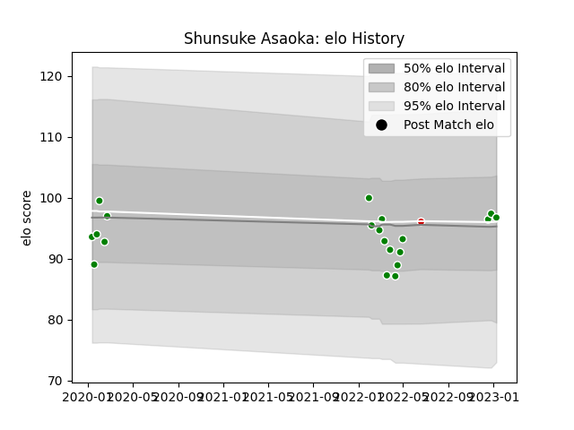

---  
layout: page  
title: Shunsuke Asaoka  
date: 2023-01-13 11:28:41.926412  
categories: player  
---
# Shunsuke Asaoka

## Positions: P

## Country: Japan

## Current elo: 97.0

## Current Percentile: 56.0

# Elo History

# Match History

| Team            |   Appearances |   Win Rate |
|:----------------|--------------:|-----------:|
| Toyota Verblitz |            20 |       0.55 |
| Japan           |             1 |       1    |

| Opponent                          |   Matches |   Win Rate |
|:----------------------------------|----------:|-----------:|
| Black Rams Tokyo                  |         3 |   0.666667 |
| Shizuoka Blue Revs                |         3 |   0.666667 |
| Kubota Spears Funabashi Tokyo-Bay |         2 |   0.5      |
| Saitama Wild Knights              |         2 |   0        |
| Toshiba Brave Lupus Tokyo         |         2 |   0.5      |
| Green Rockets Tokatsu             |         1 |   1        |
| Hino Red Dolphins                 |         1 |   1        |
| Mie Honda Heat                    |         1 |   1        |
| Mitsubishi Dynaboars              |         1 |   0        |
| NTT Docomo Red Hurricanes Osaka   |         1 |   1        |
| Tokyo Sungoliath                  |         1 |   0        |
| Urayasu D-Rocks                   |         1 |   1        |
| Uruguay                           |         1 |   1        |
| Yokohama Canon Eagles             |         1 |   0        |