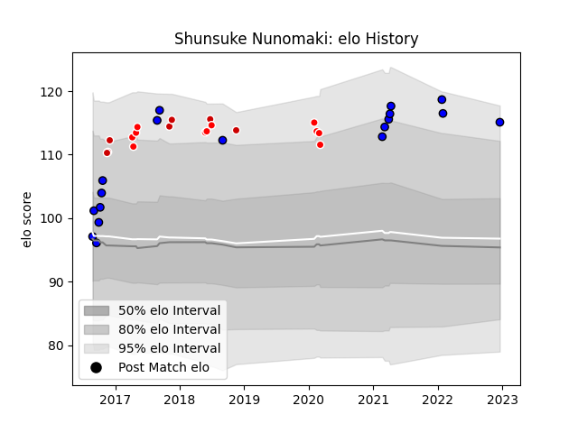

---  
layout: page  
title: Shunsuke Nunomaki  
date: 2022-12-18 16:26:54.197693  
categories: player  
---
# Shunsuke Nunomaki

## Positions: FL

## Country: Japan

## Current elo: 115.0

## Current Percentile: 94.0

# Elo History

# Match History

| Team                 |   Appearances |   Win Rate |
|:---------------------|--------------:|-----------:|
| Saitama Wild Knights |            18 |   0.861111 |
| Sunwolves            |            11 |   0.272727 |
| Japan                |             7 |   0.428571 |

| Opponent                          |   Matches |   Win Rate |
|:----------------------------------|----------:|-----------:|
| Yokohama Canon Eagles             |         4 |   1        |
| Kobelco Kobe Steelers             |         3 |   0.833333 |
| Melbourne Rebels                  |         2 |   0.5      |
| Brumbies                          |         2 |   0        |
| Bulls                             |         2 |   1        |
| Chiefs                            |         2 |   0        |
| Coca-Cola Red Sparks              |         2 |   1        |
| Georgia                           |         2 |   1        |
| Green Rockets Tokatsu             |         2 |   1        |
| Shizuoka Blue Revs                |         2 |   0.5      |
| Wales                             |         1 |   0        |
| Urayasu D-Rocks                   |         1 |   1        |
| Toshiba Brave Lupus Tokyo         |         1 |   1        |
| Tonga                             |         1 |   1        |
| Tokyo Sungoliath                  |         1 |   0        |
| Australia                         |         1 |   0        |
| Kubota Spears Funabashi Tokyo-Bay |         1 |   1        |
| Jaguares                          |         1 |   0        |
| Black Rams Tokyo                  |         1 |   1        |
| Fiji                              |         1 |   0        |
| England                           |         1 |   0        |
| Crusaders                         |         1 |   0        |
| Hurricanes                        |         1 |   0        |