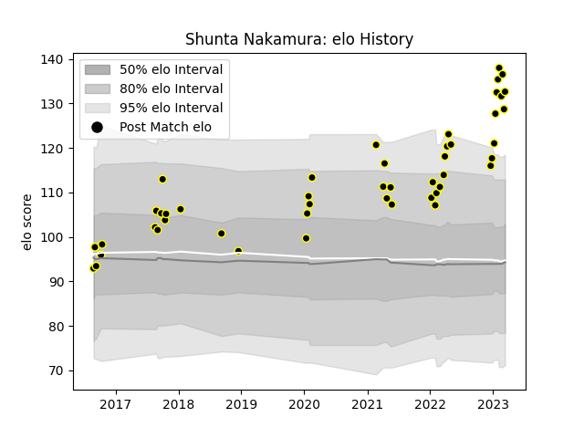

---  
layout: page  
title: Shunta Nakamura  
date: 2023-03-21 18:00:58.909273  
categories: player  
---
# Shunta Nakamura

Last updated: 2023-03-21
## Positions: H

## Current elo: 131.0

## Current Percentile: 98.0

# Elo History

# Match History

| Team             |   Appearances |   Win Rate |
|:-----------------|--------------:|-----------:|
| Tokyo Sungoliath |            47 |   0.808511 |

| Opponent                          |   Matches |   Win Rate |
|:----------------------------------|----------:|-----------:|
| Saitama Wild Knights              |         5 |   0.2      |
| Black Rams Tokyo                  |         4 |   1        |
| Green Rockets Tokatsu             |         4 |   1        |
| Toshiba Brave Lupus Tokyo         |         4 |   0.5      |
| Toyota Verblitz                   |         4 |   0.75     |
| Urayasu D-Rocks                   |         4 |   1        |
| Hanazono Kintetsu Liners          |         3 |   1        |
| Kobelco Kobe Steelers             |         3 |   0.333333 |
| Kubota Spears Funabashi Tokyo-Bay |         3 |   1        |
| NTT Docomo Red Hurricanes Osaka   |         3 |   1        |
| Shizuoka Blue Revs                |         3 |   1        |
| Yokohama Canon Eagles             |         3 |   1        |
| Mitsubishi Dynaboars              |         2 |   1        |
| Mie Honda Heat                    |         1 |   1        |
| Munakata Sanix Blues              |         1 |   1        |