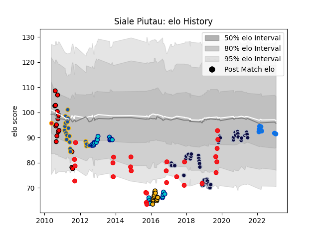

---  
layout: page  
title: Siale Piutau  
date: 2022-12-31 16:27:12.466175  
categories: player  
---
# Siale Piutau

## Positions: C, W

## Country: Tonga

## Current elo: 100.0

## Current Percentile: 66.0

# Elo History

# Match History

| Team                |   Appearances |   Win Rate |
|:--------------------|--------------:|-----------:|
| Bristol Rugby       |            61 |   0.57377  |
| Shizuoka Blue Revs  |            27 |   0.759259 |
| Tonga               |            27 |   0.37037  |
| Highlanders         |            20 |   0.45     |
| Counties Manukau    |            16 |   0.4375   |
| Wasps               |            14 |   0.714286 |
| Shimizu Blue Sharks |             7 |   0.571429 |
| Chiefs              |             1 |   0        |

| Opponent                          |   Matches |   Win Rate |
|:----------------------------------|----------:|-----------:|
| Sale Sharks                       |         7 |   0.357143 |
| Exeter Chiefs                     |         6 |   0.333333 |
| Newcastle Falcons                 |         6 |   0.833333 |
| Gloucester Rugby                  |         6 |   0.666667 |
| Harlequins                        |         5 |   0.4      |
| Worcester Warriors                |         5 |   0.4      |
| Leicester Tigers                  |         5 |   0.8      |
| Saracens                          |         5 |   0.4      |
| Bath Rugby                        |         4 |   0.75     |
| Wasps                             |         4 |   0        |
| Northampton Saints                |         4 |   0.75     |
| Saitama Wild Knights              |         3 |   0.5      |
| New Zealand                       |         3 |   0        |
| Munakata Sanix Blues              |         3 |   0.666667 |
| France                            |         3 |   0.333333 |
| London Irish                      |         3 |   0.833333 |
| United States of America          |         3 |   1        |
| Wales                             |         3 |   0        |
| Blues                             |         3 |   0        |
| Yokohama Canon Eagles             |         3 |   0.666667 |
| Manawatu                          |         2 |   1        |
| NTT Docomo Red Hurricanes Osaka   |         2 |   1        |
| Argentina                         |         2 |   0        |
| Rotherham Titans                  |         2 |   1        |
| Otago                             |         2 |   0.5      |
| Romania                           |         2 |   0.5      |
| Kobelco Kobe Steelers             |         2 |   0        |
| Toshiba Brave Lupus Tokyo         |         2 |   0.5      |
| Toyota Industries Shuttles Aichi  |         2 |   0.5      |
| Toyota Verblitz                   |         2 |   1        |
| Kyuden Voltex                     |         2 |   1        |
| Zebre                             |         2 |   1        |
| Chiefs                            |         2 |   0.5      |
| Bulls                             |         2 |   1        |
| Bay of Plenty                     |         2 |   0        |
| Black Rams Tokyo                  |         2 |   1        |
| Coca-Cola Red Sparks              |         2 |   1        |
| Hurricanes                        |         2 |   0.5      |
| Japan                             |         2 |   0.5      |
| Crusaders                         |         2 |   0.5      |
| Cheetahs                          |         2 |   1        |
| Doncaster                         |         2 |   1        |
| Green Rockets Tokatsu             |         2 |   1        |
| Georgia                           |         2 |   0.5      |
| Tasman                            |         1 |   1        |
| Taranaki                          |         1 |   0        |
| Spain                             |         1 |   1        |
| Stormers                          |         1 |   0        |
| Southland                         |         1 |   0        |
| Tokyo Sungoliath                  |         1 |   0        |
| Jersey                            |         1 |   0        |
| Toulon                            |         1 |   1        |
| Canterbury                        |         1 |   0        |
| Sharks                            |         1 |   0        |
| Urayasu D-Rocks                   |         1 |   0        |
| Waikato                           |         1 |   0        |
| Brumbies                          |         1 |   1        |
| Bordeaux Begles                   |         1 |   1        |
| Wellington                        |         1 |   1        |
| Western Force                     |         1 |   0        |
| Yorkshire Carnegie                |         1 |   1        |
| Canada                            |         1 |   0        |
| Cornish Pirates                   |         1 |   1        |
| Scotland                          |         1 |   0        |
| Chugoku Red Regulions             |         1 |   1        |
| Kubota Spears Funabashi Tokyo-Bay |         1 |   1        |
| Kurita Water Gush                 |         1 |   1        |
| Italy                             |         1 |   1        |
| La Rochelle                       |         1 |   0        |
| Lions                             |         1 |   0        |
| Hawke's Bay                       |         1 |   0        |
| Hanazono Kintetsu Liners          |         1 |   1        |
| Auckland                          |         1 |   0        |
| Mie Honda Heat                    |         1 |   1        |
| Namibia                           |         1 |   1        |
| New South Wales Waratahs          |         1 |   0        |
| Fiji                              |         1 |   0        |
| England                           |         1 |   0        |
| North Harbour                     |         1 |   1        |
| Ealing Trailfinders               |         1 |   1        |
| Northland                         |         1 |   1        |
| Nottingham                        |         1 |   1        |
| Queensland Reds                   |         1 |   0        |
| Richmond                          |         1 |   1        |
| Melbourne Rebels                  |         1 |   1        |