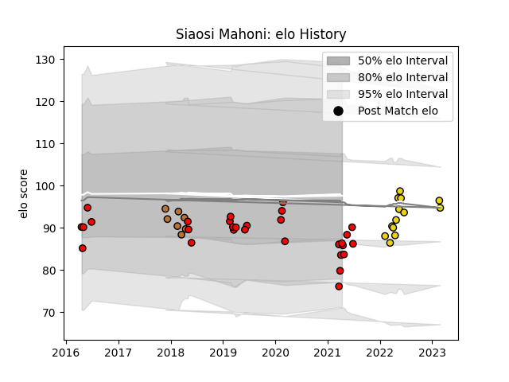

---  
layout: page  
title: Siaosi Mahoni  
date: 2023-03-21 18:17:30.171032  
categories: player  
---
# Siaosi Mahoni

Last updated: 2023-03-21
## Positions: L

## Current elo: 86.0

## Current Percentile: 17.0

# Elo History

# Match History

| Team              |   Appearances |   Win Rate |
|:------------------|--------------:|-----------:|
| San Diego Legion  |            24 |   0.5625   |
| Houston SaberCats |            15 |   0.666667 |
| Narbonne          |             7 |   0.214286 |
| San Francisco     |             5 |   0.2      |

| Opponent               |   Matches |   Win Rate |
|:-----------------------|----------:|-----------:|
| Seattle Seawolves      |         7 |   0.428571 |
| Utah Warriors          |         5 |   1        |
| L. A. Giltinis         |         4 |   0.25     |
| NOLA Gold              |         3 |   1        |
| Ohio                   |         3 |   0.333333 |
| Austin Gilgronis       |         3 |   0.333333 |
| Houston SaberCats      |         2 |   0.5      |
| Toronto Arrows         |         2 |   0.5      |
| San Diego Legion       |         2 |   1        |
| R.U. New York          |         2 |   0.5      |
| Austin Elite Rugby     |         2 |   0.5      |
| Biarritz Olympique     |         2 |   0        |
| Bayonne                |         2 |   0.5      |
| Grenoble               |         1 |   0.5      |
| Glendale Raptors       |         1 |   0.5      |
| New England Free Jacks |         1 |   1        |
| Denver                 |         1 |   0        |
| Old Glory DC           |         1 |   1        |
| Dallas Jackals         |         1 |   1        |
| Rugby ATL              |         1 |   0        |
| Rugby New York         |         1 |   0        |
| Sacramento             |         1 |   0        |
| Colorado Raptors       |         1 |   1        |
| Carcassonne            |         1 |   0        |
| Vannes                 |         1 |   0        |