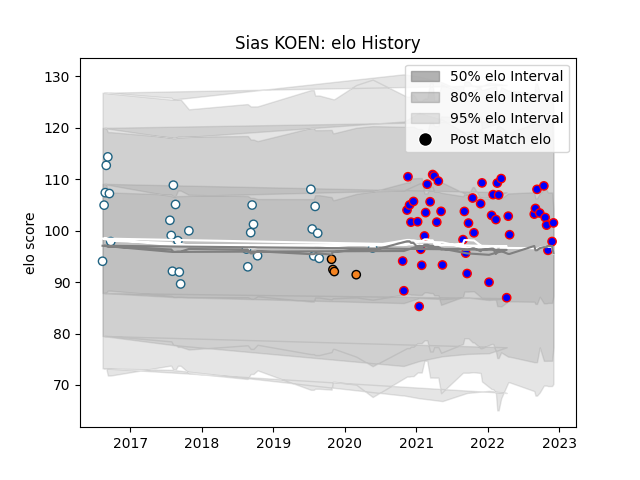

---  
layout: page  
title: Sias KOEN  
date: 2023-02-28 11:09:20.041412  
categories: player  
---
# Sias KOEN

## Positions: N8, FL

## Current elo: 98.0

## Current Percentile: 46.0

# Elo History

# Match History

| Team     |   Appearances |   Win Rate |
|:---------|--------------:|-----------:|
| Beziers  |            49 |   0.408163 |
| Griquas  |            29 |   0.37931  |
| Cheetahs |             4 |   0        |

| Opponent                   |   Matches |   Win Rate |
|:---------------------------|----------:|-----------:|
| Golden Lions               |         6 |   0.166667 |
| Natal Sharks               |         5 |   0.2      |
| Blue Bulls                 |         5 |   0.2      |
| Western Province           |         4 |   0.5      |
| Aurillac                   |         4 |   0.25     |
| Nevers                     |         4 |   0.25     |
| Grenoble                   |         4 |   0.5      |
| Provence Rugby             |         4 |   0.25     |
| Pumas                      |         4 |   0.5      |
| Carcassonne                |         4 |   0.25     |
| Mont-de-Marsan             |         4 |   0.25     |
| Colomiers                  |         3 |   0.666667 |
| Rouen                      |         3 |   0.333333 |
| Oyonnax                    |         3 |   0.166667 |
| Perpignan                  |         2 |   0.5      |
| Soyaux-Angouleme           |         2 |   0        |
| Valence Romans Drome Rugby |         2 |   0.75     |
| Vannes                     |         2 |   0.5      |
| Agen                       |         2 |   1        |
| Montauban                  |         2 |   0.5      |
| Free State Cheetahs        |         2 |   0.5      |
| Griffons                   |         1 |   1        |
| Eastern Province Kings     |         1 |   1        |
| Dragons                    |         1 |   0        |
| Connacht                   |         1 |   0        |
| Cardiff Blues              |         1 |   0        |
| Scarlets                   |         1 |   0        |
| Boland Cavaliers           |         1 |   1        |
| US Bressane                |         1 |   0        |
| Biarritz Olympique         |         1 |   1        |
| Bayonne                    |         1 |   1        |
| Massy                      |         1 |   1        |