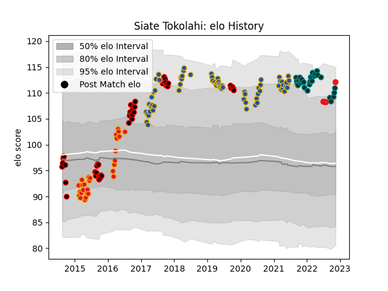

---  
layout: page  
title: Siate Tokolahi  
date: 2022-11-16 11:20:56.726139  
categories: player  
---
# Siate Tokolahi

## Positions: P

## Country: Tonga

## Current elo: 112.0

## Current Percentile: 91.0

# Elo History

# Match History

| Team        |   Appearances |   Win Rate |
|:------------|--------------:|-----------:|
| Highlanders |            67 |   0.537313 |
| Canterbury  |            47 |   0.808511 |
| Chiefs      |            28 |   0.678571 |
| Pau         |            28 |   0.446429 |
| Tonga       |             4 |   0.5      |

| Opponent                 |   Matches |   Win Rate |
|:-------------------------|----------:|-----------:|
| Blues                    |        14 |   0.642857 |
| Crusaders                |        14 |   0.357143 |
| Hurricanes               |        10 |   0.2      |
| Chiefs                   |         9 |   0.5      |
| Brumbies                 |         6 |   1        |
| North Harbour            |         6 |   0.833333 |
| Auckland                 |         5 |   1        |
| Tasman                   |         5 |   0.8      |
| Queensland Reds          |         5 |   1        |
| Otago                    |         5 |   1        |
| Melbourne Rebels         |         5 |   0.4      |
| Counties Manukau         |         5 |   0.8      |
| Highlanders              |         4 |   0        |
| Waikato                  |         4 |   1        |
| Taranaki                 |         4 |   0.5      |
| Stormers                 |         4 |   0.75     |
| Western Force            |         4 |   1        |
| Bulls                    |         4 |   0.625    |
| Hawke's Bay              |         3 |   1        |
| Clermont Auvergne        |         3 |   0.333333 |
| Bordeaux Begles          |         3 |   0.666667 |
| Sharks                   |         3 |   0.333333 |
| Northland                |         3 |   1        |
| New South Wales Waratahs |         3 |   1        |
| Montpellier Herault      |         3 |   0.333333 |
| Manawatu                 |         3 |   0.333333 |
| La Rochelle              |         3 |   0.333333 |
| Lyon                     |         3 |   0.333333 |
| Biarritz Olympique       |         2 |   1        |
| Wellington               |         2 |   0        |
| Sunwolves                |         2 |   1        |
| Jaguares                 |         2 |   1        |
| Stade Francais Paris     |         2 |   0.5      |
| Southland                |         2 |   1        |
| Racing 92                |         2 |   0        |
| Perpignan                |         2 |   1        |
| Cheetahs                 |         2 |   1        |
| Lions                    |         2 |   0        |
| Castres Olympique        |         2 |   0        |
| Samoa                    |         1 |   0        |
| Southern Kings           |         1 |   1        |
| Hong Kong                |         1 |   1        |
| Stade Toulousain         |         1 |   1        |
| Brive                    |         1 |   0        |
| British and Irish Lions  |         1 |   1        |
| Toulon                   |         1 |   0.5      |
| Fiji                     |         1 |   0        |
| Chile                    |         1 |   1        |