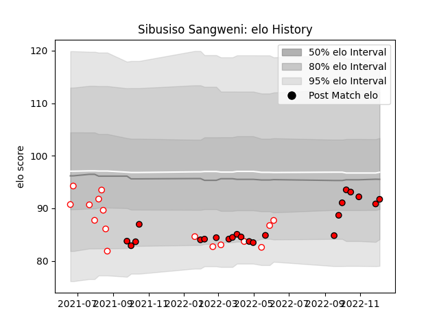

---  
layout: page  
title: Sibusiso Sangweni  
date: 2023-02-02 18:41:31.252114  
categories: player  
---
# Sibusiso Sangweni

## Positions: FL

## Current elo: 93.0

## Current Percentile: 39.0

# Elo History

# Match History

| Team         |   Appearances |   Win Rate |
|:-------------|--------------:|-----------:|
| Lions        |            27 |   0.462963 |
| Golden Lions |            17 |   0.264706 |

| Opponent             |   Matches |   Win Rate |
|:---------------------|----------:|-----------:|
| Bulls                |         3 |   0        |
| Western Province     |         3 |   0.666667 |
| Dragons              |         3 |   0.833333 |
| Griquas              |         3 |   0.333333 |
| Blue Bulls           |         3 |   0        |
| Natal Sharks         |         3 |   0.333333 |
| Pumas                |         3 |   0        |
| Munster              |         2 |   0.5      |
| Connacht             |         2 |   0        |
| Edinburgh            |         2 |   1        |
| Free State Cheetahs  |         2 |   0.25     |
| Ulster               |         2 |   0        |
| Stormers             |         2 |   0        |
| Ospreys              |         2 |   1        |
| Scarlets             |         2 |   0.5      |
| Stade Francais Paris |         1 |   1        |
| Benetton Treviso     |         1 |   1        |
| Sharks               |         1 |   0        |
| Leinster             |         1 |   0        |
| Glasgow Warriors     |         1 |   0        |
| Cardiff Blues        |         1 |   1        |
| Zebre                |         1 |   1        |