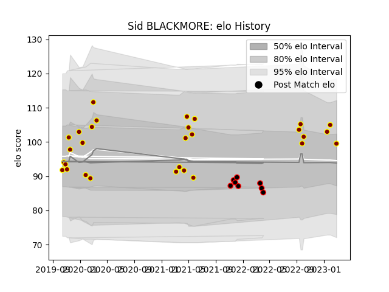

---  
layout: page  
title: Sid BLACKMORE  
date: 2023-02-02 18:55:48.329129  
categories: player  
---
# Sid BLACKMORE

## Positions: H, FL

## Current elo: 104.0

## Current Percentile: 67.0

# Elo History

# Match History

| Team            |   Appearances |   Win Rate |
|:----------------|--------------:|-----------:|
| Ampthill        |            28 |   0.517857 |
| Cornish Pirates |             8 |   0.6875   |

| Opponent            |   Matches |   Win Rate |
|:--------------------|----------:|-----------:|
| London Scottish     |         5 |   0.9      |
| Hartpury College    |         4 |   1        |
| Jersey              |         4 |   0        |
| Bedford             |         3 |   0.666667 |
| Cornish Pirates     |         3 |   0.333333 |
| Coventry            |         3 |   0.333333 |
| Doncaster           |         3 |   0.666667 |
| Ealing Trailfinders |         3 |   0        |
| Ampthill            |         2 |   0.75     |
| Nottingham          |         2 |   0.5      |
| Yorkshire Carnegie  |         2 |   1        |
| Richmond            |         1 |   1        |
| Saracens            |         1 |   0        |