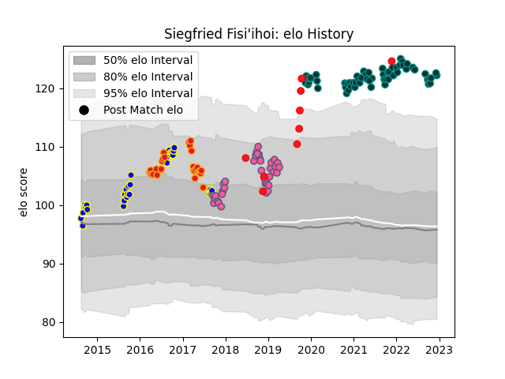

---  
layout: page  
title: Siegfried Fisi'ihoi  
date: 2022-12-14 11:34:49.799271  
categories: player  
---
# Siegfried Fisi'ihoi

## Positions: P

## Country: Tonga

## Current elo: 122.0

## Current Percentile: 98.0

# Elo History

# Match History

| Team                 |   Appearances |   Win Rate |
|:---------------------|--------------:|-----------:|
| Pau                  |            59 |   0.347458 |
| Stade Francais Paris |            36 |   0.5      |
| Bay of Plenty        |            31 |   0.322581 |
| Chiefs               |            25 |   0.74     |
| Tonga                |             9 |   0.222222 |

| Opponent                 |   Matches |   Win Rate |
|:-------------------------|----------:|-----------:|
| Toulon                   |         9 |   0.166667 |
| Castres Olympique        |         9 |   0.222222 |
| Montpellier Herault      |         7 |   0.714286 |
| Bordeaux Begles          |         7 |   0.428571 |
| Clermont Auvergne        |         6 |   0.166667 |
| Stade Toulousain         |         6 |   0.166667 |
| Lyon                     |         6 |   0.333333 |
| La Rochelle              |         5 |   0.2      |
| Hawke's Bay              |         5 |   0.4      |
| Stade Francais Paris     |         5 |   0.4      |
| Racing 92                |         5 |   0.2      |
| Perpignan                |         4 |   1        |
| Hurricanes               |         4 |   0.75     |
| Northland                |         4 |   0.5      |
| Otago                    |         4 |   0.25     |
| Pau                      |         4 |   0.75     |
| Agen                     |         3 |   0.666667 |
| Southland                |         3 |   0.333333 |
| Brive                    |         3 |   0.333333 |
| Taranaki                 |         3 |   0        |
| Blues                    |         3 |   0.833333 |
| Manawatu                 |         3 |   0.666667 |
| Queensland Reds          |         2 |   1        |
| Stormers                 |         2 |   0.5      |
| Ospreys                  |         2 |   0.5      |
| North Harbour            |         2 |   0.5      |
| New South Wales Waratahs |         2 |   0.5      |
| Wellington               |         2 |   0        |
| Western Force            |         2 |   1        |
| Melbourne Rebels         |         2 |   1        |
| Worcester Warriors       |         2 |   0        |
| Cardiff Blues            |         2 |   0.5      |
| Highlanders              |         2 |   0.5      |
| Grenoble                 |         2 |   0.5      |
| Bayonne                  |         2 |   1        |
| Fiji                     |         2 |   0.5      |
| Crusaders                |         2 |   0.5      |
| Counties Manukau         |         2 |   0.5      |
| Cheetahs                 |         2 |   0.5      |
| Brumbies                 |         1 |   1        |
| Auckland                 |         1 |   0        |
| Wales                    |         1 |   0        |
| Waikato                  |         1 |   0        |
| United States of America |         1 |   1        |
| Biarritz Olympique       |         1 |   1        |
| Tasman                   |         1 |   0        |
| British and Irish Lions  |         1 |   0        |
| London Irish             |         1 |   1        |
| Bulls                    |         1 |   1        |
| Calvisano                |         1 |   1        |
| Argentina                |         1 |   0        |
| Romania                  |         1 |   0        |
| England                  |         1 |   0        |
| France                   |         1 |   0        |
| Georgia                  |         1 |   0        |
| Krasny Yar               |         1 |   1        |
| Leicester Tigers         |         1 |   0        |